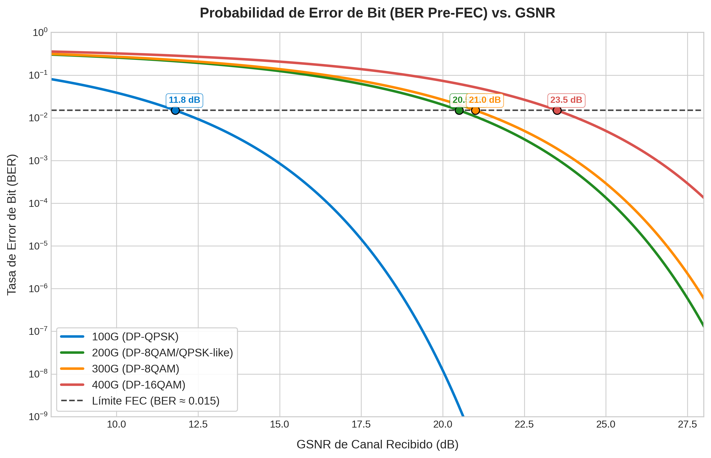
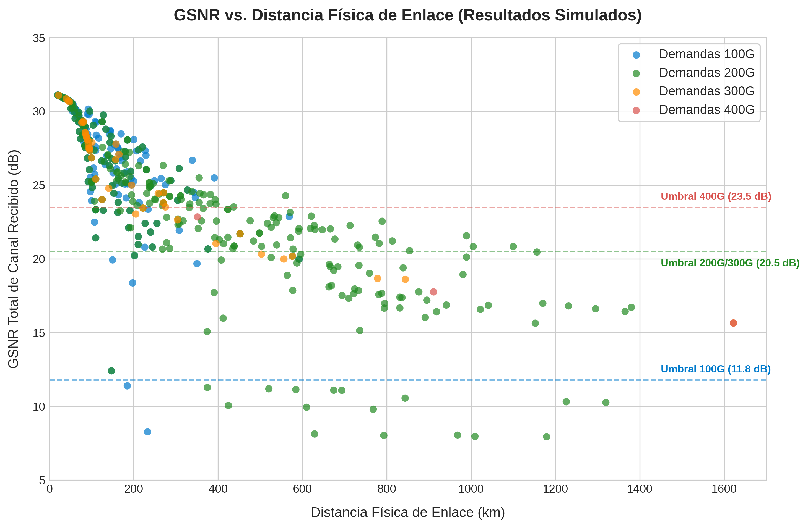

# Análisis de la Probabilidad de Error de Bit (BER) en Sistemas de Fibra Óptica Coherente

Este documento detalla la relevancia teórica y práctica de la **curva de probabilidad de error de bit (BER - Bit Error Rate)** en nuestro proyecto de actualización de la red nacional de fibra óptica (ARSAT).

---

## 1. Fundamento Teórico: Relación BER vs. GSNR

En los sistemas de transmisión óptica coherente modernos, la calidad de la señal recibida se mide mediante la **GSNR (Relación Señal-Ruido Generalizada)**, la cual consolida tanto el ruido de emisión espontánea amplificada (ASE) de los EDFAs como las interferencias no lineales (NLI) generadas en la fibra por el efecto Kerr.

El receptor óptico traduce esta GSNR óptica en una relación señal-ruido en el dominio eléctrico, caracterizada por el **Factor de Calidad (Factor Q)**. Asumiendo que el ruido acumulado se comporta de forma aproximadamente Gaussiana (Ruido Blanco Aditivo Gaussiano - AWGN), la probabilidad teórica de error de bit (BER) se relaciona directamente con el Factor $Q$ a través de la función complemento de error ($\text{erfc}$):

$$ BER = \frac{1}{2} \text{erfc}\left(\frac{Q}{\sqrt{2}}\right) $$

Donde el factor $Q$ está linealmente relacionado con la raíz cuadrada de la GSNR en escala lineal:

$$ Q \propto \sqrt{\text{GSNR}_{\text{lineal}}} $$

Por lo tanto, la curva de BER decrece monótonamente a medida que aumenta la GSNR. A continuación se presenta el gráfico con las curvas teóricas de BER vs. GSNR para cada formato de modulación y capacidad utilizado en nuestro sistema:

---

## 2. Aplicación y Utilidad en Nuestro Proyecto

La curva de BER no es solo un concepto teórico; rige de manera directa el comportamiento de los algoritmos de simulación y asignación de espectro implementados en el proyecto.

### A. Definición Científica de los Umbrales de Factibilidad
En nuestro código (`calc_rutas_gsnr.py`), cada formato de transmisión posee un umbral mínimo de aceptación (e.g., **$21.5 \text{ dB}$** para portadoras coherentes de 200G y **$23.5 \text{ dB}$** para 400G). 

Estos umbrales se derivan de la curva de BER:
1. **Límite Pre-FEC:** Los transceptores modernos Open-ROADM v5 utilizan **FEC (Forward Error Correction)**. El FEC puede corregir errores de transmisión y entregar una señal limpia (BER Post-FEC $< 10^{-12}$) **si y solo si** la BER cruda de la línea (BER Pre-FEC) no supera el umbral límite del código FEC (por ejemplo, $BER \le 1.5 \times 10^{-2}$).
2. **Determinación del Umbral de GSNR:** A partir de la curva BER vs. GSNR, se busca el valor exacto de GSNR que garantiza que la señal opere justo en el límite Pre-FEC del receptor. Si la GSNR de un trayecto cae por debajo de este límite, el BER supera la capacidad de corrección del FEC y la transmisión falla por completo.

> [!IMPORTANT]
> Los umbrales de GSNR que utiliza el script de simulación para determinar si un enlace es `FACTIBLE` o `NO FACTIBLE` son la traducción directa de los límites físicos de la curva de BER/FEC de los transceptores.

A continuación se muestra el gráfico con la distribución de las demandas reales de nuestra red base, indicando su GSNR total y su distancia física junto a los umbrales de factibilidad física de cada velocidad:

---

### B. Justificación de la Estrategia de Bajada de Velocidad (*Step-Down*)
Cuando una demanda larga (como Mendoza a Río Gallegos o Benavídez a Mendoza) no es factible a 400 Gbps, nuestro módulo de optimización `Regen_bajada.py` intenta bajar la velocidad (a 300G, 200G o 100G) antes de colocar un costoso regenerador óptico 3R.

La física detrás de esta decisión se explica a través de la curva de BER y los formatos de modulación:
* **Modulaciones Densas (400G en DP-16QAM):** Envían 8 bits por símbolo. Los puntos de la constelación están muy juntos, por lo que una pequeña cantidad de ruido provoca errores de decisión en el receptor. Esto exige un GSNR alto ($23.5 \text{ dB}$) para mantenerse bajo el límite del FEC.
* **Modulaciones Robustas (100G en DP-QPSK):** Envían 4 bits por símbolo. La constelación es más espaciada y tolerante al ruido. La curva de BER se desplaza considerablemente hacia la izquierda, requiriendo una GSNR significativamente menor (apenas **$11.8 \text{ dB}$**) para alcanzar el mismo nivel de error Pre-FEC.

> [!TIP]
> Reducir la tasa de transmisión mitiga la degradación de la señal porque relaja las exigencias de GSNR impuestas por la curva de BER de cada formato de modulación.

---

### C. Dimensionamiento de Regeneradores 3R
El algoritmo de regeneración intermedio coloca estaciones 3R (*Re-amplification, Re-shaping, Re-timing*) en los ROADMs de la ruta cuando el enlace directo excede los límites físicos de BER/GSNR. La estación 3R realiza la conversión óptico-eléctrico-óptico (OEO), decodifica los datos corrigiendo todos los errores acumulados mediante el FEC, y vuelve a transmitir la portadora con una BER limpia (reseteando la GSNR a su valor máximo nominal).

---

## 3. Conclusión

| Rol de la Curva BER | Impacto en el Proyecto |
| :--- | :--- |
| **Modelado de Enlace** | Permite transformar la GSNR calculada por el simulador físico en una factibilidad real (`SI` / `NO`). |
| **Diseño del Receptor** | Define el punto de operación límite antes de que el FEC falle catastróficamente. |
| **Flexibilidad de Red** | Sustenta físicamente la viabilidad de la bajada de velocidad (*Step-Down*) como alternativa de bajo costo a la regeneración 3R. |
