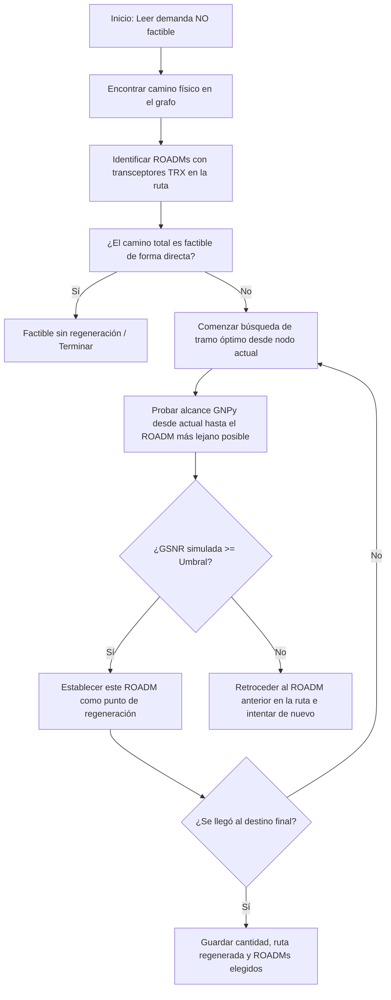

# Contexto del Proyecto: Comunicaciones Ópticas 2026

**Estado Actual:** El proyecto ha sido completamente analizado, optimizado y documentado. Se resolvieron bugs de formulación en los algoritmos de asignación de espectro, se validaron los cálculos teóricos frente al simulador GNPy, y se ejecutaron las simulaciones correspondientes tanto para el tráfico base (512 demandas) como para el tráfico REFEFO (200 demandas adicionales). El repositorio público se encuentra en `inatali074/Comunicaciones-Opticas-Proyecto`.

---

## 1. Punto 3: Análisis Teórico y Validación con GNPy (`Bocco_punto3`)

Se estructuró una memoria técnica y se calibró el modelo de estimación analítica contra el simulador profesional GNPy.

### Archivos y Documentación Generada:
*   **`metodologia_calculos_enlaces.md`**: Documento teórico que recopila y explica las fórmulas de presupuesto de potencia, dispersión cromática ($CD_{total}$ en función de la longitud de onda y la pendiente de dispersión), dispersión por modo de polarización ($PMD_{total}$ estocástica mediante suma cuadrática de fibra y nodos), OSNR/GSNR, y límites de potencia no lineal por Auto Modulación de Fase (SPM) basados en longitud efectiva no lineal.
*   **`calculos_enlaces.xlsx`**: Planilla Excel con el modelado analítico teórico detallado de las rutas críticas: **Benavídez → Mendoza** (1622 km) y **Dina Huapi → Aguada Cecilio** (592 km).
*   **`calculos_enlaces_gnpy_real.xlsx`**: Registro de simulación real obtenido mediante el motor GNPy para contrastar con los cálculos teóricos.
*   **`analisis_comparativo_gnpy.md`**: Comparación técnica y calibración entre el modelo teórico y la simulación real:
    *   **Dina Huapi → Aguada Cecilio (592 km):** La CD real (**10,656 ps/nm**) y teórica (~10,644 ps/nm) se validaron mutuamente, ubicándose por debajo del límite del DSP coherente de 400G (12,000 ps/nm). La PMD real (9.49 ps) estuvo en el rango estimado. El enlace es **factible para portadoras de 100G y 200G**, pero no para 400G por límite de GSNR.
    *   **Benavídez → Mendoza (1622 km):** Se detectó una **falla física crítica por dispersión cromática (CD)**. GNPy arrojó **27,738 ps/nm** (la teoría estimó ~29,163 ps/nm). Al exceder el límite del DSP coherente de 400G (12,000 ps/nm) en más del doble, la penalidad de dispersión es infinita (`CD penalty: inf`), requiriendo imperativamente regeneración óptica-eléctrica-óptica (OEO) a mitad de camino o el uso de portadoras de 100G (tolerancia de 77,000 ps/nm).
*   **`Analisis_DinaHuapi_AguadaCecilio.md`**: Desglose detallado tramo a tramo (7 spans) del enlace más largo de la red.
*   **`Analisis_Benavidez_Rosario.md`**: Estudio de factibilidad tramo a tramo (6 spans, 351 km). Se determinó que a 400G (DP-16QAM) no es factible de forma directa (GSNR de 22.84 dB vs Umbral de 27.0 dB) debido a la acumulación de ruido ASE y la penalidad por PDL al cruzar 7 ROADMs.

---

## 2. Punto 5: Ruteo y Asignación de Espectro (RSA) (`Pablo_punto5`)

Se analizaron y corrigieron los algoritmos implementados por Pablo para resolver el problema de asignación espectral en redes ópticas elásticas (EON).

### A. Diagnóstico y Correcciones del Algoritmo MILP (`asignacion_pulp.py`)
En el archivo `analisis_pablo_punto5.md` se detallaron los siguientes hallazgos y correcciones aplicadas:
1.  **Bug del Big-M ($M = 304$):** Al usar una constante $M$ igual al número total de slots, se bloqueaba artificialmente la asignación de demandas cerca del final de la grilla. Se incrementó la constante a un valor seguro ($M \ge 310$ o $500$).
2.  **Bug de Descarte por Timeout:** PuLP descartaba incondicionalmente cualquier solución no óptima al retornar el solver en estado `Not Solved` (por límite de tiempo). Esto causaba que la red reportara 100% de bloqueo y exportara matrices vacías. Se corrigió para evaluar y guardar soluciones factibles subóptimas si están disponibles.
3.  **Tiempos de Cómputo e Inviabilidad:** El modelo original era intratable por su complejidad (~1,730 variables binarias). Se agregaron parámetros de parada rápida en CBC (`gapRel=0.05` y `timeLimit=60s/120s`).
4.  **Diferencia de Modelado de Enlaces:** El modelo de Pablo utiliza enlaces **Direccionales** (237 enlaces únicos en el tráfico base, donde $A \to B$ y $B \to A$ tienen espectros separados). El de Mateo utiliza enlaces **Bidireccionales ordenados** (225 enlaces, forzando a compartir grilla, reduciendo a la mitad la capacidad disponible). El modelo direccional de Pablo es más preciso para representar fibra dúplex real.

### B. Resultados Comparativos de la Asignación (Tráfico Base - 512 Demandas)
| Métrica | Método Aleatorio | Método First-Fit | Método MILP (PuLP-CBC) |
| :--- | :---: | :---: | :---: |
| **Tiempo de Ejecución** | ~0.15 seg | ~0.13 seg | ~60 seg (con Gap 5%) |
| **Slot Máximo ($S_{max}$)** | 304 (rango completo) | **58** (óptimo) | **94** (subóptimo por timeout) |
| **Prob. de Bloqueo** | 0.00% | 0.00% | 0.00% |

*First-Fit compacta el espectro de manera sobresaliente y casi instantánea en comparación con un MILP truncado.*

### C. Resultados Comparativos de la Asignación (Demandas REFEFO - 200 Demandas Adicionales)
Se ejecutaron simulaciones de asignación incremental sobre el espectro ocupado por el tráfico base, con los siguientes resultados:
*   **Aleatorio (`asignacion_refefo_aleatorio.py`):**
    *   $S_{max}$ final: 304.
    *   **2 demandas bloqueadas (1.00% de bloqueo)** debido a la fragmentación espectral.
    *   Tiempo de ejecución: ~1.54s.
*   **First-Fit (`asignacion_refefo_firstfit.py`):**
    *   $S_{max}$ final: **208** (incrementó de 96 a 208).
    *   **0 demandas bloqueadas (0.00% de bloqueo)**.
    *   Tiempo de ejecución: <1.0s.
*   **MILP (`asignacion_refefo_pulp.py`):**
    *   Con un límite de 120s, el solver no halló ninguna solución entera factible (CBC retornó `Not Solved`).
    *   **200 demandas bloqueadas (100.00% de bloqueo)**, cumpliendo con la regla conservadora definida en el modelo.
    *   *Propuesta de Mejora:* Implementar una inicialización en caliente (Warm Start) inyectando la solución de First-Fit como base.

---

## 3. Mejoras del Script de Cálculo Teórico (`calc_rutas_gsnr.py`)

Se realizaron optimizaciones críticas en el motor de cálculo en Python:
1.  **Cálculo NLI Tramo a Tramo (Span-by-Span):** Se modificó la estimación del ruido no lineal (NLI). En lugar de usar una longitud efectiva promedio (`L_eff_avg`) y multiplicar linealmente por la cantidad de spans, ahora calcula la potencia real de entrada (`P_launch_w`) que ingresa a cada fibra en su tramo correspondiente y acumula el ruido tramo por tramo. Esto aumenta la precisión y calibra mejor con GNPy.
2.  **Calibración y Márgenes:** Se removieron los márgenes adicionales del sistema (`sys_margins = 0.0`) para contrastar de manera limpia los cálculos analíticos directamente contra la salida pura de GNPy.
3.  **Flexibilidad de Rutas:** Se implementó una lógica de fallback para que busque los archivos JSON y CSV dentro de la carpeta `Consigna/` si no se encuentran en la raíz de ejecución del script.
4.  **Limpieza del Output:** El CSV generado `resultados_gsnr_demandas_base.csv` ahora exporta únicamente las columnas solicitadas por la cátedra para simplificar el análisis posterior.

---

## 4. Módulo de Regeneración de Señal Óptica (`Regeneracion`)

Este módulo optimiza la ubicación de **regeneradores ópticos (3R)** en aquellas demandas de la red de fibra cuya señal directa resulta no factible debido a la degradación física (ruido ASE, interferencias no lineales NLI, etc.).

### A. Justificación y Funcionamiento
*   **Umbral GSNR:** Si la GSNR acumulada al transceptor de destino cae por debajo de **21.5 dB** (umbral de GSNR para modulación de 200 Gbps), se requiere regeneración OEO para limpiar la señal y resetear la GSNR.
*   **Algoritmo Codicioso (*Greedy*) de Retroceso:** Implementado en `Regenerador.py`. Desde el nodo destino, retrocede secuencialmente a lo largo de los ROADMs de la ruta hasta encontrar el nodo más lejano que mantenga un enlace factible (GSNR >= 21.5 dB) desde el inicio. Ubica un regenerador en dicho nodo y continúa el proceso recursivamente hacia el destino.
*   **Recorte y Simulación Dinámica:** Recorta dinámicamente el JSON de red (`network_mashe.json`) para evaluar tramos parciales usando la API de GNPy de manera iterativa.



### B. Ejecución y Requisitos de Entorno
*   **Python 3.12 y venv local:** Configurado en `Regeneracion/venv312` para satisfacer dependencias específicas de `oopt-gnpy-libyang`.
*   **Comando de Ejecución:**
    ```bash
    cd /home/maximo/opticas/TpOpticas/Regeneracion
    ./venv312/bin/python Regenerador.py
    ```

### C. Resultados Obtenidos
Los resultados optimizados se guardan en `resultados_gsnr_demandas_base_regenerado.csv`, que añade:
*   `Necesito_Regeneracion`: Booleano indicando no factibilidad directa.
*   `Reg_Factible`: Indica si se logró factibilidad mediante regeneradores en ROADMs permitidos.
*   `Reg_Count`: Cantidad de regeneradores intermedios requeridos.
*   `Ruta_Regenerada` y `Nodos_Regeneradores`: Detalle de la ruta con regeneradores y ROADMs seleccionados.

---

## 5. Próximos Pasos (Pendientes)
*   Integrar formalmente los informes del Grupo 2 (Camino más corto) y Grupo 3 (Mejor GSNR) si fuera necesario.
*   Implementar el *Warm Start* en el script MILP (`asignacion_refefo_pulp.py`) utilizando la grilla de First-Fit como solución de partida para validar si CBC logra converger en menos de 120 segundos.
*   Finalizar el informe integrador del proyecto.

