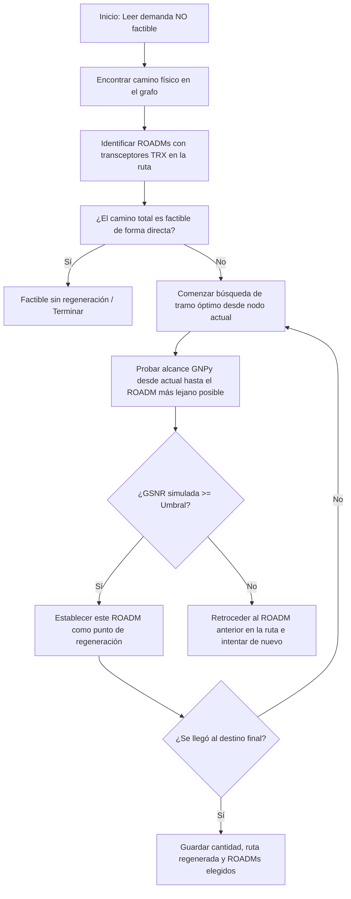

# Análisis del Módulo de Regeneración de Señal Óptica

Este directorio contiene la solución para optimizar la ubicación de **regeneradores ópticos (3R)** en aquellas demandas de la red de fibra cuya señal directa resulta no factible debido a la degradación física (ruido por emisión espontánea amplificada - ASE, interferencias no lineales - NLI, etc.).

---

## 1. ¿Por qué es necesaria la regeneración?
En redes ópticas de gran distancia (DWDM), la señal sufre degradaciones a lo largo de las fibras y amplificadores (EDFA). La calidad de la señal se mide mediante la **GSNR (Generalized Signal-to-Noise Ratio)**. 

Si la GSNR final acumulada al llegar al transceptor (TRX) de destino cae por debajo del **umbral de OSNR** requerido por el formato de modulación (por ejemplo, ~21.5 dB para 200 Gbps), la transmisión directa es imposible. Para solucionar esto, es necesario instalar **regeneradores intermedios** en nodos ROADM con transceptores disponibles, los cuales reciben la señal degradada, la convierten al dominio eléctrico para limpiarla de ruido y distorsiones, y la vuelven a transmitir al dominio óptico con la calidad original (reseteando la GSNR).

---

## 2. Funcionamiento del Algoritmo de Optimización

El script `Regenerador.py` implementa un algoritmo codicioso (*greedy*) hacia atrás para minimizar la cantidad de regeneradores intermedios en las demandas fallidas de `resultados_gsnr_demandas_base.csv`:



### Detalle del Proceso de Selección
1. **Recorte Dinámico:** Para simular cada tramo parcial en **GNPy**, la función `run_gnpy_on_path` recorta dinámicamente el JSON de la red (`network_mashe.json`) para incluir únicamente los elementos físicos (fibras, ROADMs, amplificadores) del tramo evaluado.
2. **Lanzamiento de Simulación:** Genera un archivo JSON temporal y ejecuta el simulador físico de GNPy (`transmission_main_example`), capturando su salida de consola para extraer el valor GSNR obtenido.
3. **Decisión Decisiva (Backstepping):** 
   - Supongamos una ruta: `Mendoza -> San Juan -> Patquia -> Chilecito -> Belen`.
   - Intenta transmitir directamente de `Mendoza` a `Belen`. Si falla (GSNR < 21.5 dB), intenta de `Mendoza` a `Chilecito`.
   - Si de `Mendoza` a `Chilecito` la GSNR supera el umbral, coloca un regenerador en `Chilecito`.
   - Luego, el nodo actual pasa a ser `Chilecito`, y repite el proceso buscando llegar hasta `Belen`.

---

## 3. Estructura de Código

El script se organiza en las siguientes funciones clave:

*   **`clean(name)`**: Normaliza los nombres de los nodos ROADM y transceptores eliminando prefijos de texto para consistencia en el CSV y GNPy.
*   **`extract_gsnr(output_text)`**: Utiliza expresiones regulares para extraer la métrica de GSNR final en dB desde la salida estándar de GNPy.
*   **`sanitize_network(net)`**: Valida y limpia las configuraciones de ganancia por grado (`per_degree_pch_out_db` y `per_degree_power_targets`) de los ROADMs en la subred recortada para prevenir errores en GNPy.
*   **`run_gnpy_on_path(...)`**: Construye el archivo JSON temporal del segmento de red a evaluar, redirecciona la salida estándar para ejecutar la API de GNPy, obtiene la GSNR y limpia el archivo temporal.
*   **`optimize_regeneration(...)`**: Algoritmo central que calcula de forma recursiva/iterativa hacia atrás las ubicaciones óptimas de regeneradores.

---

## 4. Ejecución del Módulo

Debido a que el simulador físico de la red requiere una versión de Python compatible con los binarios compilados de `oopt-gnpy-libyang`, se configuró un entorno local específico.

### Requisitos de Entorno
*   **Python 3.12** (requerido para utilizar las ruedas precompiladas de `oopt-gnpy-libyang` en sistemas Debian/Ubuntu sin dependencias de compilación adicionales).
*   **Virtualenv local:** Ubicado en `/home/maximo/opticas/TpOpticas/Regeneracion/venv312`.

### Instrucción para Ejecutar el Script
Para ejecutar el script de regeneración y actualizar los resultados, utiliza el intérprete del entorno virtual creado:

```bash
cd /home/maximo/opticas/TpOpticas/Regeneracion
./venv312/bin/python Regenerador.py
```

### Resultados
El script lee la planilla base y guarda los resultados en:
*   `/home/maximo/opticas/TpOpticas/resultados_gsnr_demandas_base_regenerado.csv`

El archivo de salida incluye las siguientes nuevas métricas:
*   `Necesito_Regeneracion`: Indica `SI` si la ruta original no era factible de manera directa.
*   `Reg_Factible`: Indica `SI` si fue posible hacer factible el enlace colocando regeneradores intermedios en los ROADMs disponibles.
*   `Reg_Count`: Cantidad total de regeneradores intermedios requeridos.
*   `Ruta_Regenerada`: El camino lógico secuencial de transmisión (ej. `Mendoza -> San Juan -> Patquia -> Chilecito`).
*   `Nodos_Regeneradores`: Listado específico de ROADMs donde se deben instalar físicamente las tarjetas regeneradoras.
