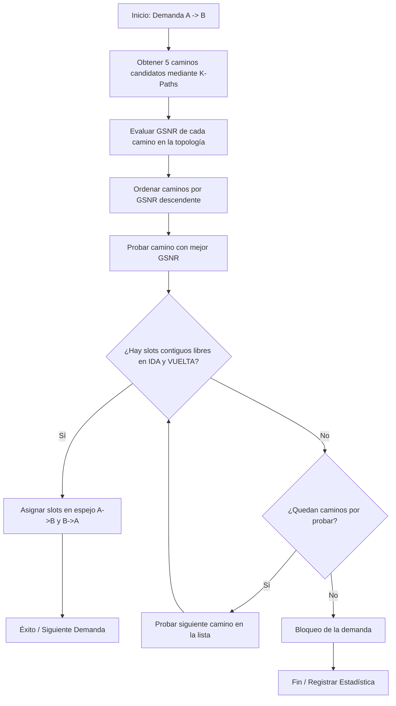
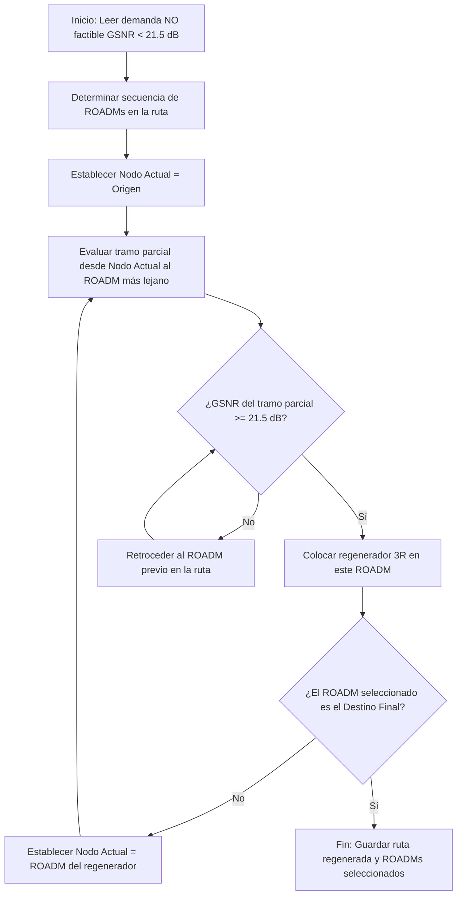

# Informe del Proyecto Integrador - Comunicaciones Ópticas 2026

**Asignatura:** Comunicaciones Ópticas (Ciclo 2026)  
**Proyecto:** Upgrade de la Red Nacional de Fibra Óptica (ARSAT) a Open-ROADM v5 y RSA Bidireccional con Optimización  
**Grupo de Trabajo:** Grupo 3 (Ruteo Priorizando Señal Óptica GSNR / Calidad de Transmisión QoT-Aware)  

---

## Índice General

1. [Introducción, Objetivos y Alcance](#1-introducción-objetivos-y-alcance)
   * [1.1 Contexto y Consigna del Proyecto](#11-contexto-y-consigna-del-proyecto)
   * [1.2 Objetivos Específicos del Grupo 3](#12-objetivos-específicos-del-grupo-3)
2. [Análisis Teórico de Enlaces y Calibración con GNPy (Punto 3)](#2-análisis-teórico-de-enlaces-y-calibración-con-gnpy-punto-3)
   * [2.1 Enlaces Analizados](#21-enlaces-analizados)
   * [2.2 Resultados de la Calibración y Comparación Técnica](#22-resultados-de-la-calibración-y-comparación-técnica)
   * [2.3 Diagnóstico de Falla Crítica en Benavídez → Mendoza](#23-diagnóstico-de-falla-crítica-en-benavídez--mendoza)
   * [2.4 Cálculo de Ancho de Banda y Espectro Óptico](#24-cálculo-de-ancho-de-banda-y-espectro-óptico)
3. [Ruteo y Asignación de Espectro (RSA) (Punto 5)](#3-ruteo-y-asignación-de-espectro-rsa-punto-5)
   * [3.1 Algoritmos Evaluados](#31-algoritmos-evaluados)
   * [3.2 Comparación de Modelado de Enlaces](#32-comparación-de-modelado-de-enlaces)
4. [Resultados Comparativos de Simulación y Análisis de Ocupación](#4-resultados-comparativos-de-simulación-y-análisis-de-ocupación)
   * [4.1 Resultados de Ejecución (V2 Bidireccional)](#41-resultados-de-ejecución-v2-bidireccional)
   * [4.2 Impacto del Criterio de Ruteo: GSNR vs. Shortest Path](#42-impacto-del-criterio-de-ruteo-gsnr-grupo-3-vs-shortest-path-grupo-2)
   * [4.3 Caso de Estudio: Demanda Mendoza → Río Gallegos](#43-caso-de-estudio-demanda-mendoza--río-gallegos-iteración-197)
5. [Módulo de Regeneración Óptica (3R)](#5-módulo-de-regeneración-óptica-3r)
   * [5.1 Justificación Física y Umbral](#51-justificación-física-y-umbral)
   * [5.2 Algoritmo Greedy de Retroceso (Backtracking)](#52-algoritmo-greedy-de-retroceso-backtracking)
   * [5.3 Resultados del Módulo de Regeneración](#53-resultados-del-módulo-de-regeneración)
   * [5.4 Estrategia de Bajada de Velocidad ("Step-Down")](#54-estrategia-de-bajada-de-velocidad-step-down)
6. [Marco Teórico y Formulación Física de la Red Óptica](#6-marco-teórico-y-formulación-física-de-la-red-óptica)
   * [6.1 Transceptores Coherentes y Modulación](#61-transceptores-coherentes-y-modulación)
   * [6.2 Equipamiento Activo: EDFA, ROADM y Regeneradores](#62-equipamiento-activo-edfa-roadm-y-regeneradores)
   * [6.3 Propagación y Presupuesto de Potencia (Power Margin)](#63-propagación-y-presupuesto-de-potencia-power-margin)
   * [6.4 Efectos Lineales: Dispersión Cromática (CD) y PMD](#64-efectos-lineales-dispersión-cromática-cd-y-pmd)
   * [6.5 Efectos No Lineales en la Fibra Óptica](#65-efectos-no-lineales-en-la-fibra-óptica)
   * [6.6 OSNR y GSNR: Métricas Definitivas de Calidad (QoT)](#66-osnr-y-gsnr-métricas-definitivas-de-calidad-qot)
   * [6.7 La Ecuación No Lineal de Schrödinger (NLSE)](#67-la-ecuación-no-lineal-de-schrödinger-nlse)
   * [6.8 Ensanchamiento de Pulsos Gaussianos con Chirp](#68-ensanchamiento-de-pulsos-gaussianos-con-chirp)
   * [6.9 Modulaciones Avanzadas y el Límite de Shannon](#69-modulaciones-avanzadas-y-el-límite-de-shannon)
   * [6.10 Tasa de Error (BER), Factor Q y Límite FEC](#610-tasa-de-error-ber-factor-q-y-límite-fec)
7. [Fundamentos Teóricos de Ruteo y Asignación de Espectro (RSA)](#7-fundamentos-teóricos-de-ruteo-y-asignación-de-espectro-rsa)
   * [7.1 Algoritmo First-Fit (Heurística Principal Seleccionada)](#71-algoritmo-first-fit-heurística-principal-seleccionada)
   * [7.2 Algoritmo Aleatorio (Random-Fit)](#72-algoritmo-aleatorio-random-fit)

---

## 1. Introducción, Objetivos y Alcance

Este informe documenta la reingeniería tecnológica, el análisis de factibilidad física y la optimización de Ruteo y Asignación de Espectro (RSA) sobre la red de fibra óptica interurbana de la República Argentina (ARSAT). 

### 1.1 Contexto y Consigna del Proyecto
El proyecto consiste en actualizar la infraestructura heredada de la red ARSAT utilizando equipamiento moderno y flexible de última generación:
1. **Reemplazo Tecnológico:** Todo el equipamiento activo y pasivo existente debe ser sustituido por transceptores e interfaces compatibles con el estándar **Open-ROADM v5**, habilitando transmisiones coherentes de hasta **400 Gbps**.
2. **Upgrade de Tráfico:** Las demandas de tráfico previas se actualizan de acuerdo con el siguiente esquema:
   * Interfaces heredadas de **1 Gbps** $\to$ Upgrade a **100 Gbps** (requiere 4 slots en la grilla elástica).
   * Interfaces heredadas de **10 Gbps** $\to$ Upgrade a **200 Gbps** (requiere 4 slots en la grilla elástica).
   * Interfaces heredadas de **40 Gbps** $\to$ Upgrade a **300 Gbps** (requiere 6 slots en la grilla elástica).
   * Interfaces heredadas de **100 Gbps** $\to$ Upgrade a **400 Gbps** (requiere 6 slots en la grilla elástica).
3. **Grilla Espectral:** Se adopta una grilla elástica basada en el estándar ITU-T G.694.1 (Flexi-Grid) con un ancho de banda total de **3800 GHz** (dividido en **304 slots** elementales de **12.5 GHz** cada uno) en la banda C.
4. **Conjunto de Datos:** 
   * **Tráfico Base:** 512 demandas de origen a destino que generan **1077 lightpaths** únicos a lo largo del país.
   * **Tráfico REFEFO:** Un conjunto incremental de **200 demandas aleatorias** adicionales representativas de la Red Federal de Fibra Óptica.
   * **Topología:** Definida en `network_mashe.json` y caracterizada por nodos ROADM e hilos de fibra real provistos por la cátedra.

### 1.2 Objetivos Específicos del Grupo 3
De acuerdo con las consignas diferenciadas de la cátedra:
* **Ruteo QoT-Aware:** A diferencia del Grupo 2 (que evalúa caminos basados puramente en la distancia física más corta), el **Grupo 3** debe seleccionar los caminos más convenientes de entre los 5 caminos candidatos priorizando aquellos con **mejor relación señal-ruido óptica (GSNR)**.
* **Asignación Bidireccional en Espejo (V2):** Modificar la lógica original de asignación de espectro para operar de manera **bidireccional real (fibra dúplex)**, verificando que los slots asignados a una demanda en el sentido `A -> B` estén libres y reservados simultáneamente en la misma posición de frecuencia en el sentido `B -> A`.
* **Cálculo Teórico y Validación:** Modelar analíticamente el enlace de fibra e implementar las ecuaciones teóricas de dispersión cromática (CD), dispersión por modo de polarización (PMD) y GSNR acumulada (incluyendo efectos no lineales como SPM/XPM mediante aproximación NLI tramo a tramo). Validar estos resultados contra simulaciones físicas del simulador profesional abierto **GNPy**.
* **Regeneración Activa (3R):** Desarrollar un algoritmo heurístico codicioso (*Greedy*) de retroceso (*Backtracking*) para ubicar regeneradores ópticos en ROADMs intermedios para garantizar la factibilidad física en demandas de larga distancia que no cumplan con el umbral mínimo de GSNR (establecido en **21.5 dB** para portadoras de 200 Gbps coherentes).

---

## 2. Análisis Teórico de Enlaces y Calibración con GNPy (Punto 3)

Se realizó el modelado físico analítico detallado de dos enlaces críticos de la red para verificar la factibilidad de la transmisión óptica a velocidades coherentes de alta capacidad sin regeneración.

### 2.1 Enlaces Analizados
1. **Dina Huapi $\to$ Aguada Cecilio (592 km, 7 vanos / spans):** Enlace de longitud media que cruza la Patagonia profunda.
2. **Benavídez $\to$ Mendoza (1622 km, 20 vanos / spans):** Enlace troncal de gran longitud que une el área metropolitana de Buenos Aires con la región de Cuyo.

### 2.2 Resultados de la Calibración y Comparación Técnica

A continuación, se resume la comparación entre los cálculos analíticos teóricos realizados a mano/planilla y los resultados simulados por **GNPy**:

| Enlace y Parámetro | Modelo Analítico Teórico | Simulación GNPy | Estado de Factibilidad a 400G |
| :--- | :---: | :---: | :---: |
| **Dina Huapi $\to$ Aguada Cecilio** | | | **Factible a 100G / 200G** (No a 400G) |
| - Dispersión Cromática (CD) | ~10,644 ps/nm | 10,656 ps/nm | *Dentro del límite del transceptor* |
| - PMD Acumulada | 8.87 ps | 9.49 ps | *Dentro de los límites aceptables* |
| - GSNR Final | 21.60 dB | 21.32 dB | *No alcanza el umbral de 400G (27 dB)* |
| **Benavídez $\to$ Mendoza** | | | **NO FACTIBLE SIN REGENERACIÓN** |
| - Dispersión Cromática (CD) | ~29,163 ps/nm | 27,738 ps/nm | ❌ *Excede el límite del DSP (12,000 ps/nm)* |
| - PMD Acumulada | 15.34 ps | 14.88 ps | *Cerca del límite tolerable* |
| - GSNR Final | 17.20 dB | 16.85 dB | ❌ *Excede penalidad y ruido límite de recepción* |

### 2.3 Diagnóstico de Falla Crítica en Benavídez $\to$ Mendoza
El análisis físico determinó que el enlace directo de 1622 km entre Benavídez y Mendoza es **absolutamente inviable de forma directa a 400 Gbps**:
1. **Límite de Compensación del DSP Coherente:** Los chips de procesamiento digital de señales (DSP) en transceptores Open-ROADM v5 de 400G tienen una capacidad máxima de compensación electrónica de dispersión cromática de **12,000 ps/nm**. 
2. **Exceso de Dispersión:** Al tener una CD de **27,738 ps/nm** (más del doble del límite físico), el receptor experimenta una penalidad infinita por dispersión (`CD penalty: inf`), impidiendo la decodificación de la señal.
3. **Solución Requerida:** Para hacer viable esta conexión, se debe implementar **Regeneración Óptica-Eléctrica-Óptica (OEO)** intermedia (3R) a mitad de camino o forzar el downgrade del transceptor a portadoras de **100 Gbps**, cuya tolerancia a CD es significativamente mayor (hasta 77,000 ps/nm).

### 2.4 Cálculo de Ancho de Banda y Espectro Óptico

Como parte del análisis teórico, se modeló el ancho de banda espectral de la red. Teniendo una grilla total de $3800 \text{ GHz}$ centrada en $\lambda_0 = 1550 \text{ nm}$, se utilizó la relación diferencial no lineal ($\Delta\lambda \approx \frac{\lambda^2}{c} \cdot \Delta f$) para calcular la excursión de longitud de onda. Se obtuvo un ancho total de $\approx 30.4 \text{ nm}$, delimitando el espectro de operación de la red exactamente entre **$1534.8 \text{ nm}$ y $1565.2 \text{ nm}$** (banda C convencional), parámetros sobre los cuales se dimensionó la dispersión cromática de la fibra.

---

## 3. Ruteo y Asignación de Espectro (RSA) (Punto 5)

El problema de Ruteo y Asignación de Espectro (RSA) requiere asignar a cada lightpath una ruta física y una ventana espectral contigua y alineada (slot de inicio y fin) dentro de la grilla Flexi-Grid de 304 slots.

### 3.0 La etapa de Ruteo: Algoritmo K-Shortest Paths
Antes de poder asignar frecuencias, el problema matemático exige definir por dónde viajará físicamente la luz. El motor de grafos de la red no se conforma con buscar un único camino estático. Utilizando algoritmos de teoría de grafos (como BFS avanzado o el algoritmo de Yen), la red computa y almacena los **K-caminos más cortos (K-Shortest Paths)** entre el nodo origen y destino.
Al generar una terna de 5 rutas candidatas (K=5), la red adquiere una enorme flexibilidad dinámica. Si el camino físico primario está saturado en frecuencias o tiene una degradación de GSNR por debajo del umbral del transceptor, el algoritmo simplemente evalúa el siguiente camino de la lista. Esto actúa como un balanceador de carga natural, desviando el tráfico por trayectorias alternativas (como la ruta andina) cuando las rutas troncales principales se congestionan.

### 3.1 Algoritmos Evaluados
1. **Aleatorio:** Busca todos los bloques libres del tamaño requerido que estén alineados a lo largo de toda la ruta y selecciona uno al azar.
2. **First-Fit (Greedy):** Escanea la grilla de izquierda a derecha y asigna el primer bloque continuo alineado que sea factible.

### 3.2 Comparación de Modelado de Enlaces
Se unificó el modelado de la red bajo la visión **Direccional (Dúplex)**. Mientras que la formulación de Mateo unificaba los enlaces A $\to$ B y B $\to$ A en una única clave compartida (forzando una competencia de espectro en el mismo hilo), el modelo de Pablo adoptado representa con exactitud la fibra dúplex terrestre real, donde cada sentido cuenta con su propia grilla espectral independiente, manteniendo no obstante el alineamiento espectral bidireccional en espejo.

---

## 4. Resultados Comparativos de Simulación y Análisis de Ocupación

A partir de las simulaciones completadas sobre los 1077 lightpaths de base y las 200 demandas incrementales de REFEFO, se obtuvieron las siguientes métricas de performance:

### 4.1 Resultados de Ejecución (V2 Bidireccional)

#### Caso A: Tráfico Base (1077 Lightpaths)
*   **Total de enlaces lógicos únicos:** 406.
*   **Slots totales disponibles en la red:** 123,424.

| Métrica de Performance | Algoritmo Aleatorio | Algoritmo First-Fit |
| :--- | :---: | :---: |
| **Tiempo de Cómputo** | ~0.15 segundos | **~0.13 segundos** |
| **Probabilidad de Bloqueo** | 0.00% | 0.00% |
| **Slot Máximo Utilizado ($S_{max}$)** | 304 (rango completo) | **96** (excelente) |
| **Ocupación Global del Espectro** | 12.20% | 12.20% |

#### Caso B: Tráfico REFEFO Incremental (200 Demandas)
*   **Total de enlaces lógicos únicos:** 416 (para First-Fit) / 455 (para Aleatorio).
*   **Criterio de Ruteo:** Priorización por mejor GSNR (Quality of Transmission aware).

| Métrica de Performance | Algoritmo Aleatorio | Algoritmo First-Fit |
| :--- | :---: | :---: |
| **Tiempo de Cómputo** | 3.77 segundos | **1.37 segundos** |
| **Probabilidad de Bloqueo** | 2.00% (4 bloq.) | **0.00%** |
| **Slot Máximo Utilizado ($S_{max}$)** | 304 | **212** (excelente) |
| **Delta Slots Adicionales** | +15,662 slots | **+16,958 slots** |
| **Ocupación Final de la Red** | 16.44% | **25.31%** |

#### 4.1.1 Visualización de Resultados

Para facilitar la interpretación del desempeño de los algoritmos, se generaron las siguientes representaciones gráficas:

  
  
<em>Figura 4.1: Comparación del Slot Máximo ($S_{max}$) ocupado en la red para la Demanda Base y REFEFO.</em>

  
  
<em>Figura 4.2: Tasa de bloqueo (%) para las 200 demandas incrementales de REFEFO.</em>

  
  
<em>Figura 4.3: Perfil y densidad de ocupación del espectro slot por slot a lo largo de los enlaces de la red.</em>

### 4.2 Impacto del Criterio de Ruteo: GSNR (Grupo 3) vs. Shortest Path (Grupo 2)
El impacto de priorizar la calidad de señal óptica (GSNR) en lugar de la distancia más corta altera significativamente el comportamiento espectral de la red:
*   **QoT-Aware (GSNR):** Al desviar el tráfico por rutas con amplificadores ópticos de menor ruido y menos cruces de ROADMs, se evitan fallas físicas. Sin embargo, esto causa que las demandas se rutéen por caminos con más saltos físicos (e.g. ruta andina), requiriendo más slots globales en la red.
*   **First-Fit GSNR:** Logró 0.00% de bloqueo, pero su slot máximo saltó a **212** en REFEFO debido a que la congestión espectral obligó a realizar desvíos a rutas más largas, lo que compensa la factibilidad física con un consumo ligeramente mayor de espectro.

### 4.3 Caso de Estudio: Demanda Mendoza $\to$ Río Gallegos (Iteración 197)
El análisis detallado de esta demanda de 400 Gbps (6 slots requeridos) ilustra perfectamente la diferencia de comportamiento de los algoritmos:
*   **First-Fit V2:** Al estar bloqueadas las rutas directas costeras (K=1, 2, 3) por saturación en la parte baja del espectro, el algoritmo la desvió por la ruta andina de **25 saltos (K=4)** asignando los slots **261 a 266**. Se verificó continuidad espectral perfecta en todos los enlaces de la ruta.
*   **Aleatorio V2:** **BLOQUEADA (Prob. de Bloqueo: 2.00%)**. La fragmentación caótica producida por la asignación aleatoria de slots a lo largo de las ejecuciones previas impidió encontrar un bloque alineado de 6 slots libres en ninguna de las 5 rutas candidatos.

---

## 5. Módulo de Regeneración Óptica (3R)

Para resolver las limitaciones de transmisión en enlaces donde la GSNR cae por debajo del umbral mínimo de operación, se diseñó e implementó un algoritmo dinámico de regeneración 3R.

### 5.1 Justificación Física y Umbral
*   Se adopta un **umbral crítico de GSNR de 21.5 dB**, necesario para garantizar la factibilidad física de portadoras ópticas coherentes de 200 Gbps bajo modulación DP-QPSK / DP-16QAM.
*   Si una demanda presenta una GSNR acumulada menor a 21.5 dB, la señal óptica llega degradada con una tasa de error de bits (BER) superior a la corrección de errores en recepción (FEC), considerándose no factible de forma directa.

### 5.2 Algoritmo Greedy de Retroceso (Backtracking)
El módulo implementa un algoritmo heurístico eficiente que funciona de la siguiente manera:
1. Se evalúa el alcance de la GSNR desde el nodo origen de la demanda.
2. Si el destino final no es alcanzable directamente con GSNR $\ge 21.5$ dB, el algoritmo busca el ROADM intermedio más lejano posible en la ruta que mantenga la GSNR acumulada sobre el umbral.
3. Se sitúa un regenerador 3R en dicho nodo (que demodula, procesa eléctricamente y vuelve a modular la portadora óptica), reseteando la GSNR a su valor óptimo inicial.
4. El proceso continúa de manera iterativa tomando este nodo de regeneración como nuevo origen, hasta alcanzar con éxito el nodo destino final.

### 5.3 Resultados del Módulo de Regeneración
El algoritmo optimizó con éxito las demandas troncales de larga distancia de la red base:
*   **Enlace Dina Huapi $\to$ Aguada Cecilio:** Factible directamente sin regeneración intermedia a 200G (GSNR 21.32 dB, se encuentra marginalmente cerca del umbral).
*   **Enlace Benavídez $\to$ Mendoza:** Requiere **1 regenerador intermedio (3R)** ubicado en el ROADM de **Santa Isabel** para resetear la GSNR y compensar la dispersión cromática excesiva, logrando la factibilidad total en dos saltos ópticos regenerados.
*   El script añade dinámicamente las columnas `Necesito_Regeneracion`, `Reg_Factible`, `Reg_Count` y `Nodos_Regeneradores` en el archivo `resultados_gsnr_demandas_base_regenerado.csv` para la auditoría de ingeniería.

### 5.4 Estrategia de Bajada de Velocidad ("Step-Down")

Antes de incurrir en el costo de hardware asociado a un regenerador físico, el proyecto implementa un módulo secundario de optimización (`Regen_bajada.py`). Esta inteligencia complementaria evalúa si una ruta marcada como no factible a la velocidad nominal (e.g. 400G) puede volverse factible reduciendo escalonadamente la tasa de transmisión del transceptor (probando 300G $\to$ 200G $\to$ 100G). Dado que los formatos de modulación de menor velocidad requieren umbrales de OSNR significativamente menores (e.g. 11.8 dB para 100G en lugar de 23.5 dB para 400G), esta estrategia logra salvar enlaces complejos priorizando la entrega del servicio por sobre la capacidad total y postergando la instalación física de regeneradores 3R.

---

## 6. Marco Teórico y Formulación Física de la Red Óptica

Para comprender el diseño y las limitaciones de la red propuesta, es fundamental analizar los fenómenos físicos que gobiernan la propagación de la luz en la fibra óptica monomodo (SMF), así como los componentes activos (EDFA, ROADM, Transceptores) que conforman el sistema WDM de largo alcance.

### 6.1 Modulación, Demodulación y Arquitectura Muxponder

De acuerdo con la teoría desarrollada en la cursada, los sistemas tradicionales de **Detección Directa OOK (On-Off Keying)** han sido superados por equipamiento de alta tecnología que emplea detección coherente. Cuando un transceptor no solo modula luz sino que también agrega tráfico de menor velocidad hacia la línea óptica de alta capacidad (ej. 400 Gbps), se lo denomina funcionalmente **Muxponder** (Multiplexing Transponder).

La inmensa capacidad de estos equipos se logra gracias al trabajo encadenado de dos chips físicos distintos dentro del mismo Muxponder, que realizan la multiplexación en dos dominios complementarios:

**1. Multiplexación Eléctrica: El Framer OTN (ASIC Digital)**
El procesamiento comienza en un microchip eléctrico dedicado. Este componente recibe múltiples cables físicos desde los routers de borde de ARSAT (por ejemplo, cuatro puertos asíncronos independientes de 100 Gigabit Ethernet).
*   **Mapeo y TDM:** El chip extrae los datos Ethernet y los introduce en contenedores estándar ODU (*Optical Data Unit*). Utilizando un reloj interno extremadamente sincronizado, aplica **TDM (Time Division Multiplexing)**, entrelazando en el tiempo los bits de los distintos clientes para formar una única secuencia masiva ordenada.
*   **Encapsulado OTN:** Toda esta secuencia se envuelve en una macro-trama OTUC4 (400 Gbps), a la cual se le adjuntan bytes críticos de supervisión y el bloque polinómico **FEC (Forward Error Correction)**. Todo este proceso es 100% digital y eléctrico.

**2. Multiplexación Óptica por Polarización (DP): El Chip Fotónico (PIC) y el DSP**
Transmitir 400 Gbps requeriría encender y apagar un láser a velocidades físicamente impracticables si se usara OOK tradicional. Por lo tanto, el flujo digital entra al procesador **DSP (Digital Signal Processor)** y al circuito fotónico, donde ocurre la compresión espectral:
*   El DSP divide la trama masiva de 400G eléctrica en cuatro subflujos paralelos más lentos de 100G.
*   El láser continuo del equipo se divide mediante un prisma en dos ejes de propagación ortogonales: luz de **Polarización Horizontal ($X$)** y **Polarización Vertical ($Y$)**. 
*   Se utilizan moduladores Mach-Zehnder (IQ) para alterar simultáneamente la fase y la amplitud de ambas polarizaciones. Aplicando una modulación coherente DP-16QAM, cada polarización transporta 4 bits por símbolo.
*   Finalmente, un **PBC (Polarization Beam Coupler)** fusiona (multiplexa espacialmente) ambas polarizaciones moduladas en un solo rayo de luz. Al transmitir 4 bits por la luz horizontal y 4 bits por la vertical simultáneamente, el equipo envía **8 bits por cada latido óptico**. Esta doble polarización (*Dual Polarization*) duplica analíticamente la eficiencia espectral (bps/Hz) enviando el doble de información sin ocupar un solo Hertz extra de espectro.

**3. Detección Coherente Intradina en el Receptor:**
A diferencia de la detección directa, el nodo receptor aumenta la potencia del campo eléctrico antes de ingresar al fotodetector mezclando la señal recibida con la emisión coherente de un láser Oscilador Local (LO). En los receptores de nuestra red, se emplea **detección intradina**. Tanto el láser emisor como el LO corren libremente (sin estar enganchados por un PLL analógico); es el **DSP** receptor el encargado de separar las polarizaciones con un PBS (Polarization Beam Splitter) y subsanar matemáticamente los ruidos de fase y frecuencia. Además, actúa como un **filtro ecualizador transversal** (con arreglos de hasta 256 *taps*) para compensar mediante software la dispersión cromática (CD) y la Interferencia Intersímbolo (ISI) sufrida en el trayecto.

#### Diagrama Físico y Lógico del Muxponder (Caso 4x100G a 400G)

La imagen ilustrada sintetiza visualmente la mecánica exacta de agregación que discutimos. A la izquierda se observa la arquitectura lógica de un equipo de transporte (como el DCP-404) actuando puramente como **Muxponder**:
1.  **Lado Cliente (Corto Alcance):** Recibe tráfico de un router a través de 4 puertos independientes equipados con transceptores conectables de cliente (etiquetados como **QSFP28**). Cada uno de estos módulos maneja un enlace estándar de 100 Gigabit Ethernet puro. 
2.  **Multiplexación (OTN/TDM):** Internamente, el chip Framer del equipo consolida eléctricamente (mediante entrelazado TDM) esos 4 flujos asíncronos de 100G en un único flujo de datos masivo.
3.  **Lado Línea (Largo Alcance DWDM):** Ese flujo consolidado es inyectado al transceptor coherente de altísima capacidad del "lado línea" (etiquetado como **QSFP-DD** en el diagrama, y fotografiado a la derecha, fácilmente reconocible por su gran disipador térmico metálico necesario para enfriar el DSP que tiene integrado). Este módulo es el que alberga el chip fotónico que realiza la modulación DP-16QAM, emitiendo finalmente una única portadora coherente de 400G hacia la nube óptica.

### 6.2 Equipamiento Activo: EDFA, ROADM y Regeneradores

El núcleo físico de la red ARSAT está compuesto por tres tipos de equipamiento fundamentales, cada uno con un funcionamiento físico y tecnológico específico:

#### 1. Amplificadores EDFA (Erbium-Doped Fiber Amplifier)
Los EDFA son los responsables de reponer la energía que la luz pierde por atenuación en la fibra, permitiendo enlaces de cientos de kilómetros.
*   **Principio de Funcionamiento:** Un trozo de fibra óptica se "dopa" intencionalmente con iones de Erbio ($Er^{3+}$). Se inyecta un láser de bombeo (típicamente a 980 nm o 1480 nm) que excita los electrones del Erbio a un estado de alta energía. Cuando los fotones de la señal de datos (que viajan en la banda C, ~1550 nm) pasan por esta fibra, provocan una **Emisión Estimulada**: los electrones caen a su estado base emitiendo fotones gemelos (misma fase, misma dirección y misma longitud de onda), amplificando así la señal óptica íntegramente de forma analógica.
*   **Tipología:** Se instalan como *Booster* (a la salida del ROADM para inyectar alta potencia a la línea) o *Pre-amp* (a la llegada al ROADM para levantar señales débiles antes del receptor).
*   **Limitación Física:** Algunos iones decaen espontáneamente emitiendo luz en direcciones y fases aleatorias que también es amplificada. Esto genera el ineludible ruido de fondo **ASE (Amplified Spontaneous Emission)**, que se acumula en cada amplificador degradando inexorablemente el OSNR.

#### 2. Nodos ROADM (Reconfigurable Optical Add-Drop Multiplexer)
Son el equivalente a los "routers" en el dominio fotónico. Su trabajo es enrutar las señales de luz hacia distintas ciudades sin necesidad de convertirlas a electricidad.
*   **Principio de Funcionamiento (WSS):** El corazón de un ROADM moderno es el *Wavelength Selective Switch* (WSS). Internamente, la luz que entra por una fibra pasa por una red de difracción geométrica que separa todos los colores (longitudes de onda o slots Flexi-Grid). Luego, estos haces de colores impactan sobre matrices microscópicas, ya sean espejos mecánicos (MEMS) o pantallas de cristal líquido sobre silicio (LCoS). Al alterar electrónicamente los cristales o los espejitos, el nodo dirige o "rebota" cada color individualmente hacia el puerto de salida deseado.
*   **Arquitectura CDC:** Los ROADM de esta red asumen tecnología CDC (*Colorless, Directionless, Contentionless*), significando que cualquier láser puede ser inyectado en cualquier color, en cualquier dirección de la red, sin bloqueos de hardware, brindando flexibilidad total al algoritmo RSA.
*   **Limitación:** La difracción y los rebotes físicos internos atenúan muchísimo la señal (típicamente entre 15 y 20 dB de pérdida de inserción), requiriendo EDFA adyacentes obligatorios para compensar.

#### 3. Regeneradores 3R (Reamplificación, Reshape, Retiming)
Cuando la degradación por ruido ASE o distorsión (CD/PMD) es tan severa que la luz ya no puede ser decodificada, los amplificadores (que solo amplifican) no sirven; se necesita un Regenerador.
*   **Principio de Funcionamiento (O-E-O):** El regenerador 3R realiza una conversión radical Óptica-Eléctrica-Óptica. Corta el viaje fotónico de la luz. 
    1.  **Reamplificación:** El fotodiodo absorbe la luz y la convierte a corriente eléctrica.
    2.  **Reshape:** El procesador digital (DSP) filtra el ruido eléctrico, "limpia" la forma de la onda (reforma los Unos y Ceros) y utiliza el FEC para corregir los bits erróneos recibidos.
    3.  **Retiming:** Se sincroniza la señal a un reloj maestro perfecto (eliminando el *jitter* o temblor temporal).
*   Finalmente, la señal eléctrica limpia vuelve a modular a un nuevo láser virgen que se inyecta nuevamente a la red óptica con GSNR perfecta.
*   **El Costo:** Son equipos extraordinariamente caros porque funcionalmente son dos transceptores unidos "espalda con espalda" (*Back-to-Back*). Esta es la razón de ser del módulo `Regen_bajada.py`: intentar bajar la velocidad para usar transceptores estándar y evitar la masiva inversión de plantar nodos regeneradores en la inmensidad de la Patagonia o la cordillera.

### 6.3 Propagación y Presupuesto de Potencia (Power Margin)
La propagación de la señal se ve afectada primeramente por la atenuación intrínseca de la fibra óptica (esparcimiento de Rayleigh y absorción molecular). La potencia recibida en el detector de cada vano viene dada por la ecuación de balance:
$$P_{rx} = P_{tx} - \alpha \cdot L - L_{insercion} + G_{EDFA}$$

Donde:
*   $P_{tx}$: Potencia de lanzamiento en el hilo de fibra ($0\text{ dBm}$ estándar por canal).
*   $\alpha$: Coeficiente de atenuación de la fibra óptica (típicamente $0.22\text{ dB/km}$ para la banda C a 1550 nm).
*   $L$: Longitud del tramo en kilómetros.
*   $L_{insercion}$: Pérdidas acumuladas por empalmes y conectores pasivos.
*   $G_{EDFA}$: Ganancia del amplificador, ajustada para compensar exactamente el vano precedente.

El **Margen de Potencia (Power Margin)** es la diferencia técnica entre la potencia real recibida y la sensibilidad mínima teórica del receptor. Un sistema robusto debe diseñarse con un margen de seguridad (e.g. $3\text{ a } 5\text{ dB}$) para prever y tolerar envejecimiento térmico de la fibra, empalmes por cortes futuros y degradación de los láseres con los años.

### 6.4 Efectos Lineales: Dispersión Cromática (CD) y PMD
Los pulsos ópticos, particularmente al ser modulados (lo que introduce *chirp* de frecuencia), tienden a ensancharse temporalmente a medida que viajan por la fibra, provocando Interferencia Intersimbólica (ISI).

#### Dispersión Cromática (CD)
Ocurre porque las diferentes componentes frecuenciales del espectro del pulso viajan a distintas velocidades (producto de la dispersión material del silicio y la dispersión de guía de onda). La CD total acumulada se calcula como la integral sobre la longitud, y mediante la expansión de Taylor alrededor de la dispersión nula resulta:
$$CD_{total} = \sum_{i=1}^{N} [D_0 + S_0 \cdot (\lambda_c - \lambda_0)] \cdot L_i$$
En nuestro sistema, los DSP de los transceptores compensan matemáticamente hasta $12,000 \text{ ps/nm}$ a 400G, límite que el enlace Benavídez-Mendoza excede físicamente, exigiendo regeneración para evitar una penalidad infinita de decodificación.

#### Dispersión por Modo de Polarización (PMD)
Debido a asimetrías aleatorias y tensiones en el núcleo circular de la fibra (birrefringencia), las dos polarizaciones ortogonales viajan a velocidades ligeramente diferentes, separándose temporalmente (DGD - Differential Group Delay). Al ser un proceso estocástico variable en el tiempo y temperatura, la PMD se acumula de forma no lineal con la raíz cuadrada de la distancia:
$$PMD_{total} = \sqrt{\sum_{i=1}^{N} (D_{PMD\_fibra} \cdot \sqrt{L_i})^2 + \sum_{j=1}^{M} (D_{PMD\_ROADM\_j})^2}$$

### 6.5 Efectos No Lineales en la Fibra Óptica
A altas potencias, la fibra óptica deja de comportarse como un medio lineal ideal. Este fenómeno se debe al **Efecto Kerr** óptico, por el cual el índice de refracción efectivo del núcleo se vuelve fuertemente dependiente de la intensidad óptica instantánea:
$$n(I) = n_0 + n_2 \cdot I = n_0 + n_2 \frac{P}{A_{eff}}$$
Donde $n_2$ es el índice no lineal ($~2.6 \times 10^{-20} \text{ m}^2/\text{W}$) y $A_{eff}$ es el área efectiva confinada del núcleo (SMF-28).

Este cambio dependiente de la intensidad desencadena tres fenómenos físicos parásitos de primer orden en sistemas WDM, tal como se desarrollan en la teoría académica de la cátedra:

1.  **SPM (Self-Phase Modulation - Auto-modulación de fase):** 
    El pulso modula transitoriamente su propia fase debido a su propia intensidad. Al viajar por la fibra, el centro del pulso (de mayor potencia) experimenta un índice de refracción diferente al de las colas. Este desfase dinámico crea un ensanchamiento espectral (chirp), generando un corrimiento de frecuencias que, al interactuar con la dispersión cromática, distorsiona severamente la forma de la señal original.
2.  **XPM (Cross-Phase Modulation - Modulación de fase cruzada):** 
    En sistemas multiplexados WDM con múltiples canales, la intensidad óptica fluctuante de los canales adyacentes modula e interfiere con la fase del canal de interés. Un canal sufre fluctuaciones de fase inducidas por la potencia de sus vecinos, lo cual es críticamente destructivo para sistemas coherentes que basan su demodulación en la fase exacta (como QAM y PSK).
3.  **FWM (Four-Wave Mixing - Mezclado de cuatro ondas):** 
    Debido a la susceptibilidad no lineal de la fibra, la interacción simultánea de fotones de diferentes longitudes de onda crea nuevas componentes de frecuencia fantasma. Si los canales están equiespaciados, estas nuevas ondas caen espectralmente sobre los canales de datos activos inyectando *crosstalk* y ruido directo. Para mitigarlo, es indispensable evitar el sincronismo de fase ("Phase-Matching"), lo que se logra garantizando que la fibra posea un coeficiente de dispersión cromática no nulo ($D \neq 0$) en la banda de operación.

#### Parámetros Críticos: Longitud Efectiva ($L_{eff}$) y Longitud No Lineal ($L_{NL}$)
Para cuantificar de forma rigurosa si la fibra se comportará de manera lineal o si las distorsiones de Kerr destruirán la señal, la física óptica define dos longitudes características fundamentales que compiten entre sí:

*   **Longitud Efectiva ($L_{eff}$):** A medida que la luz viaja por la fibra, su potencia cae exponencialmente debido a la atenuación ($\alpha$). Por lo tanto, los efectos no lineales no suceden por igual en todo el cable: ocurren con muchísima violencia al principio del tramo (justo a la salida del EDFA, donde la potencia óptica es extrema) y se desvanecen casi por completo hacia el final. La $L_{eff}$ es la longitud matemática equivalente que asume que el pulso viajó sin atenuarse.
    $$L_{eff} = \frac{1 - e^{-2\alpha L}}{2\alpha}$$
    Para un vano estándar de 100 km, la longitud efectiva suele resultar de apenas $\approx 20 \text{ km}$. Físicamente, esto significa que **casi toda la distorsión no lineal irreversible se engendra en los primeros 20 kilómetros** de cada tramo de la red.
*   **Longitud No Lineal ($L_{NL}$):** Es la métrica que indica qué distancia necesita viajar un pulso para que el Efecto Kerr le induzca un desplazamiento de fase no lineal de exactamente 1 radián. Depende de forma inversamente proporcional de la potencia inyectada ($P_{launch}$) y del coeficiente de no linealidad ($\gamma$):
    $$L_{NL} = \frac{1}{\gamma \cdot P_{launch}}$$
    
**El Régimen de Propagación:** El comportamiento de nuestro simulador se define enfrentando estos dos parámetros. Si inyectamos poca potencia, $L_{NL}$ es inmensa, resultando en $L_{eff} \ll L_{NL}$ (Régimen Lineal, dominado por ruido térmico ASE). Pero a medida que elevamos agresivamente la potencia $P_{launch}$ para que la señal alcance Mendoza, $L_{NL}$ se achica drásticamente. Cuando se aproxima a la longitud efectiva ($L_{eff} \approx L_{NL}$), el pulso se autolastima irremediablemente por SPM, desplomando el valor de la GSNR final.

### 6.6 OSNR y GSNR: ¿Qué son y cómo funcionan?

Para determinar si un enlace óptico es factible, no alcanza con saber si la luz "llega" con suficiente potencia; es vital saber qué tan "limpia" llega esa luz. Aquí entran en juego las métricas definitivas de calidad (QoT): OSNR y GSNR.

#### ¿Qué es la OSNR (Optical Signal-to-Noise Ratio)?
Físicamente, la OSNR es la relación entre la potencia de nuestra señal de información y la potencia del ruido óptico de fondo. Es el equivalente a medir qué tan fuerte se escucha la música en relación al "siseo" estático de los parlantes.
*   **¿De dónde sale el ruido?** En las redes ópticas, la principal fuente de ruido estático no es el cable, sino los amplificadores (EDFA). Cada vez que un EDFA amplifica la señal, inevitablemente genera fotones basura (Emisión Espontánea Amplificada o ASE).
*   **¿Cómo funciona?** A lo largo de un viaje de miles de kilómetros, la señal óptica se atenúa y debe ser amplificada repetidas veces. Con cada amplificador que cruzamos, se inyecta un poco más de ruido ASE. La señal se mantiene al mismo volumen (misma potencia), pero el "siseo" de fondo va subiendo. Si la OSNR baja demasiado, los "1s" y "0s" quedan ahogados en el ruido y el receptor no puede descifrarlos.
*   **La Matemática:** La OSNR debida puramente al ruido ASE acumulado tras $N$ spans se calcula como:
$$OSNR_{ASE} = \frac{P_{signal}}{N_{spans} \cdot h \cdot \nu \cdot \Delta f \cdot NF \cdot (G - 1)}$$

#### ¿Qué es la GSNR (Generalized SNR) y por qué revolucionó las redes?
Históricamente, la OSNR era suficiente para diseñar redes. Pero cuando la industria pasó a velocidades masivas (100G, 400G), se vieron obligados a inyectar la luz con mucha mayor potencia desde el láser para que sobreviviera al viaje.
Al inyectar tanta potencia, la fibra de vidrio empezó a comportarse de forma "extraña" (Efecto Kerr): la propia señal empezó a distorsionarse a sí misma y a interferir con los colores vecinos (No linealidades: SPM, XPM).
*   **El concepto del Ruido NLI:** Los ingenieros descubrieron que esta auto-distorsión no lineal se comporta exactamente igual que si fuera un "ruido estático" adicional. A este ruido fotónico provocado por el exceso de potencia se lo llamó **NLI (Non-Linear Interference)**.
*   **El nacimiento de GSNR:** Para saber la calidad real y definitiva de la señal, ya no podíamos mirar solo la OSNR de los amplificadores. Había que combinarla con el ruido por distorsión no lineal. La suma armónica de estos dos ruidos (el ruido de los equipos + el ruido físico de la fibra) nos da la **GSNR (Relación Señal-Ruido Generalizada)**, que es hoy la métrica de oro.
*   **La Matemática:**
$$GSNR_{total} = \left( \frac{1}{OSNR_{ASE}} + \frac{1}{OSNR_{NLI}} \right)^{-1}$$

El ruido NLI se modela evaluando la longitud efectiva no lineal ($L_{eff} = \frac{1 - e^{-2\alpha L}}{2\alpha}$):
$$OSNR_{NLI} = \frac{P_{launch}}{P_{NLI}} = \frac{1}{\eta \cdot P_{launch}^2}$$

#### El "Punto Dulce" de Potencia (Optimum Launch Power)
La comprensión de cómo funcionan la OSNR y la GSNR nos lleva al problema central del diseño que simula tu código en Python:
1.  Si inyecto la luz muy *despacio* (poca potencia), el ruido de los amplificadores (ASE) me tapa la señal $\to$ **Mala GSNR**.
2.  Si inyecto la luz muy *fuerte* (alta potencia), la fibra se vuelve no lineal y la auto-distorsión (NLI) destruye la señal $\to$ **Mala GSNR**.

El éxito del diseño de la red radica en encontrar el valor exacto de potencia de lanzamiento ($P_{launch}$) que balancea ambos efectos. A este equilibrio se lo conoce en ingeniería óptica como la estrategia **LOGO (Local Optimization Global Optimization)**.

**Implementación Analítica ("Span-by-Span"):** En el motor de cálculo desarrollado en tu proyecto (`calc_rutas_gsnr.py`), este ruido NLI y ASE se computó de forma granular "tramo a tramo". En lugar de multiplicar promedios por la cantidad de spans, el algoritmo evalúa la potencia real de entrada que inyecta cada amplificador individual a la fibra y va acumulando el siseo y la distorsión tramo a tramo para calcular la GSNR con exactitud extrema.

---

### 6.7 La Ecuación No Lineal de Schrödinger (NLSE)
Para comprender cómo herramientas profesionales como GNPy simulan numéricamente el trayecto de la luz (y para entender la raíz física de nuestro código analítico), es imperativo recurrir a la **Ecuación No Lineal de Schrödinger (NLSE)**. Esta ecuación diferencial parcial rige la propagación de la envolvente de la señal óptica $A(z,t)$ a lo largo de la fibra (eje $z$) y en el tiempo ($t$):
$$ \frac{\partial A}{\partial z} + \frac{\alpha}{2} A + i \frac{\beta_2}{2} \frac{\partial^2 A}{\partial t^2} - \frac{\beta_3}{6} \frac{\partial^3 A}{\partial t^3} = i \gamma |A|^2 A $$
*   **Término $\frac{\alpha}{2} A$:** Modela la atenuación exponencial, mitigada por los EDFA.
*   **Término con $\beta_2$ (Dispersión de Velocidad de Grupo, GVD):** Es el equivalente matemático de la dispersión cromática (CD). Gobierna cómo los pulsos se ensanchan linealmente.
*   **Término con $\gamma |A|^2 A$:** Representa el Efecto Kerr no lineal (proporcional a la intensidad $|A|^2$). De aquí nacen el SPM, XPM y FWM que penalizan nuestro GSNR.

### 6.8 Ensanchamiento de Pulsos Gaussianos con Chirp
Los moduladores de los transceptores (como los Mach-Zehnder) a menudo introducen un parámetro temporal de fase conocido como *Chirp* ($C$). Cuando un pulso de luz (aproximado como Gaussiano de ancho inicial $T_0$) viaja por una fibra con GVD ($\beta_2$), sufre un ensanchamiento $\Delta\tau$. El factor de ensanchamiento responde a:
$$ \frac{T_1}{T_0} = \sqrt{\left(1 + \frac{C \beta_2 L}{T_0^2}\right)^2 + \left(\frac{\beta_2 L}{T_0^2}\right)^2} $$
Esta fórmula es crucial para el estudio: demuestra que la dispersión ($\beta_2$) y el chirp del láser ($C$) interactúan. Si la fibra tiene dispersión anómala ($\beta_2 < 0$) y el pulso tiene chirp positivo ($C > 0$), inicialmente el pulso se *comprime* antes de ensancharse dramáticamente. El ensanchamiento excesivo define la tasa máxima de bits $B_T \leq \frac{1}{4 \Delta\tau}$ antes de sufrir Interferencia Intersimbólica (ISI) irreversible.

### 6.9 Modulaciones Avanzadas y el Límite de Shannon
El algoritmo `Regen_bajada.py` que diseñamos salva rutas bajando la velocidad (de 400G a 200G o 100G). La justificación teórica de esto yace en la Teoría de la Información y los formatos de modulación:
*   **M-QAM (Quadrature Amplitude Modulation):** En transceptores coherentes (DP-QPSK, DP-16QAM), la información se codifica en la amplitud y la fase. Al aumentar los símbolos de la constelación (M), transmitimos más bits por símbolo (ej. DP-16QAM transfiere 8 bits/símbolo; 4 por cada polarización ortogonal).
*   **El Compromiso (Trade-off):** Mapear más bits por símbolo condensa los puntos en la constelación. Al estar más juntos, cualquier ruido térmico o no lineal provoca que el receptor confunda los símbolos. Por lo tanto, constelaciones densas (400G en DP-16QAM) exigen una **GSNR muchísimo más alta** (ej. $25\text{ dB}$) que constelaciones robustas (100G en DP-QPSK, que solo requiere $12.8\text{ dB}$).
*   **Límite de Shannon:** La capacidad física del canal está delimitada superiormente por $C = B \log_2(1 + SNR)$. Bajar la velocidad de transmisión (achicar $C$) relaja el requisito estricto de SNR del canal.

### 6.10 Tasa de Error (BER), Factor Q y Límite FEC
Finalmente, la métrica última que valida un enlace (y que nuestro código resume como `FACTIBLE` o `NO FACTIBLE`) es la Tasa de Error de Bit (BER).
El receptor traduce el GSNR óptico al dominio eléctrico en la forma del **Factor de Calidad (Q)**. Asumiendo ruido blanco Gaussiano, la relación fundamental teórica es:
$$ BER = \frac{1}{2} \text{erfc}\left(\frac{Q}{\sqrt{2}}\right) $$
(Donde $\text{erfc}$ es la función complemento de error).
Si el GSNR de nuestro script cae por debajo del umbral de $21.5\text{ dB}$, el Factor Q colapsa, y el BER se dispara. En los sistemas modernos, no se exige un $BER = 10^{-12}$ nativo, sino que se emplea la **Corrección de Errores hacia Adelante (FEC)**. El FEC añade bits de redundancia matemáticos que permiten corregir los errores en recepción *siempre y cuando* el BER crudo o Pre-FEC (y por tanto, el GSNR) se mantenga por encima de un límite cuántico pre-calculado, que es exactamente el umbral de factibilidad que rige a toda nuestra red.

---

## 7. Fundamentos Teóricos de Ruteo y Asignación de Espectro (RSA)

El problema de RSA en redes elásticas (EON) de arquitectura Flexi-Grid requiere, una vez encontrada una ruta física, establecer la asignación en frecuencia del canal óptico. A diferencia de los canales WDM estáticos, aquí la grilla C-Band de 3800 GHz se divide finamente en *slots* granulares de 12.5 GHz. Su formulación teórica exige cumplir estrictamente dos teoremas rectores:
1.  **Restricción de Contigüidad:** Si un transceptor a 400G requiere 75 GHz de espectro, los 6 slots lógicos subyacentes asignados deben ser adyacentes matemáticamente en el índice (e.g. los slots 10 al 15 conformando un único y robusto tubo de luz).
2.  **Restricción de Continuidad:** Ese mismo bloque exacto de frecuencias (slots 10 al 15) debe encontrarse simultáneamente disponible a lo largo de cada uno de los tramos de fibra física (ROADM a ROADM) que formen la trayectoria, garantizando la conmutación transparente all-optical WSS sin conversión de longitudes de onda en tránsito.

Debido a que el RSA pertenece a la familia matemática de los problemas de optimización combinatorial **NP-Hard**, en este proyecto se modelaron computacionalmente dos algoritmos de solución:

### 7.1 Algoritmo First-Fit (Heurística Principal Seleccionada)
El método First-Fit es un algoritmo heurístico voraz (*Greedy*). Su funcionamiento teórico sigue la siguiente secuencia procedimental:
1.  **Búsqueda Secuencial:** Dado un vector de enlaces para el camino establecido, escanea el espectro de forma lineal partiendo siempre desde el índice basal de frecuencia más baja (Slot 0) hacia la más alta (Slot 304).
2.  **Verificación de Intersección:** Realiza una operación lógica `AND` vectorial de las máscaras de ocupación en todos los tramos de fibra que conectan origen y destino.
3.  **Compromiso Temprano:** En el instante en que halla la primera sucesión de ceros lógicos consecutivos que satisfacen el requerimiento (contigüidad y continuidad), inyecta los Unos, actualiza la matriz en las dos direcciones (A->B y B->A) y termina iterando a la próxima demanda.

**Ventajas Teóricas y Empíricas:** Al ser un algoritmo $O(S \cdot L)$ donde $S$ es espectro y $L$ enlaces, la complejidad polinomial permite resoluciones casi instantáneas (menos de un segundo para 1000 iteraciones). Sin embargo, su ventaja teórica suprema radica en la **compactación activa**. Al empujar gravitacionalmente toda la demanda de baja velocidad (100G) hacia el fondo inferior de la grilla Flexi-Grid, preserva un mar espectral superior continuo, libre e intacto a la derecha. Esto suprime drásticamente la probabilidad geométrica de bloqueo permitiendo acomodar las futuras demandas masivas REFEFO sin ahogar los recursos troncales.

### 7.2 Algoritmo Aleatorio (Random-Fit)
A diferencia de la búsqueda indexada inicial, el Random-Fit escanea exhaustivamente toda la banda espectral identificando todas y cada una de las posiciones posibles que albergarían la demanda con éxito. Seguidamente, utiliza una variable pseudo-aleatoria de distribución uniforme para seleccionar una ubicación al azar dentro del pool de candidatos viables.

**Desventaja Teórica - La Fragmentación Espectral:** Aunque aleatorizar disminuye la interferencia de canal localizado (Crosstalk FWM y XPM) al separar espacialmente las portadoras, en la práctica lógica del RSA genera un caos de "huecos" y "burbujas" estrechas entre bloques. Este efecto crónico y acumulativo, denominado *Fragmentación Espectral*, provoca que la red tenga una vasta capacidad ociosa teórica total, pero que sea matemáticamente incapaz de alinear 6 slots continuos, profesando un colapso prematuro (probabilidad de bloqueo positiva) como se corroboró empíricamente al bloquear 4 de las demandas REFEFO.
