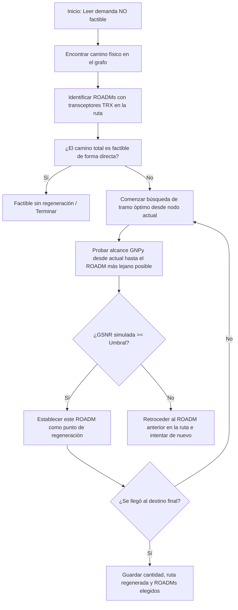
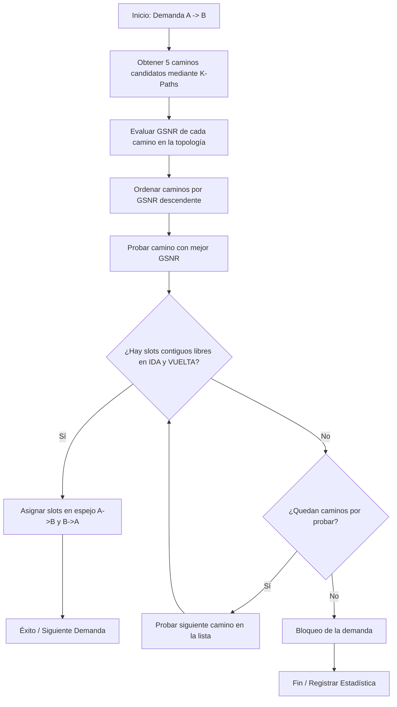

# Informe del Proyecto Integrador - Upgrade y Optimización de la Red Nacional de Fibra Óptica (ARSAT)

**Asignatura:** Comunicaciones Ópticas (Ciclo 2026)  
**Proyecto:** Reingeniería Tecnológica a Open-ROADM v5 y Ruteo y Asignación de Espectro (RSA) Bidireccional  
**Grupo de Trabajo:** Grupo 3 (Ruteo Priorizando Calidad de Transmisión QoT-Aware / GSNR)  
**Integrantes:** Mateo Andreani, Santiago Boccolini, Ignacio Natali, Maximo Juan  

---

## 1. Introducción, Objetivos y Alcance

El presente trabajo documenta el proceso de reingeniería tecnológica, la evaluación de la viabilidad física y la posterior optimización del Ruteo y Asignación de Espectro (RSA) en la red troncal de fibra óptica interurbana de la República Argentina (ARSAT). La consigna central de este proyecto radica en la actualización de la infraestructura de red heredada, empleando para ello equipamiento moderno de última generación que sea plenamente compatible con el estándar abierto Open-ROADM v5, lo cual permite soportar transmisiones coherentes de hasta 400 Gbps. A tal fin, se proyecta un incremento significativo en la capacidad de transmisión del tráfico interurbano. En particular, las interfaces heredadas de 1 Gbps y 10 Gbps se elevan a capacidades de 100 Gbps y 200 Gbps, respectivamente, requiriendo en ambos casos un ancho espectral de cuatro canales o slots. Por otra parte, los enlaces preexistentes de 40 Gbps y 100 Gbps se actualizan a 300 Gbps y 400 Gbps, respectivamente, demandando para ello una asignación de seis slots espectrales. Este esquema de multiplexación flexible se implementa sobre una grilla elástica definida bajo la recomendación ITU-T G.694.1 (Flexi-Grid) en la banda C, la cual abarca un ancho de banda total de 3800 GHz subdividido en 304 slots elementales de 12.5 GHz. Para la validación experimental, se dispone de dos conjuntos de datos: un escenario de tráfico base, documentado en el archivo [Demanda_Base - Tráfico base.csv](file:///home/maximo/opticas/TpOpticas/Demanda_Base%20-%20Tr%C3%A1fico%20base.csv), que comprende 512 demandas de origen a destino que generan 1077 caminos de luz (*lightpaths*) únicos a nivel nacional, y un conjunto incremental de tráfico REFEFO constituido por 200 demandas aleatorias adicionales de la Red Federal de Fibra Óptica, todo ello modelado sobre la topología física provista en el archivo [network_mashe.json](file:///home/maximo/opticas/TpOpticas/Consigna/network_mashe.json).

En este contexto, el Grupo 3 asume objetivos específicos de diseño y optimización física. A diferencia de las metodologías tradicionales que seleccionan rutas basadas únicamente en la distancia física más corta, se plantea aquí un enrutamiento consciente de la calidad de transmisión (QoT-Aware), donde se priorizan aquellos caminos candidatos que exhiben la mejor relación señal-ruido óptica generalizada (GSNR). Asimismo, se requiere desarrollar un esquema de asignación espectral bidireccional en espejo, en el cual se garantiza que los slots reservados para el sentido directo coincidan exactamente en posición y estado libre en el sentido de retorno de la fibra dúplex. Adicionalmente, el análisis físico del medio de transmisión exige modelar analíticamente la acumulación de dispersión cromática, la dispersión por modo de polarización y los efectos no lineales a través de un cálculo de interferencia no lineal tramo a tramo, validando la precisión del modelo matemático frente al simulador profesional GNPy. Finalmente, para aquellos enlaces en los que la degradación física impida alcanzar el umbral de viabilidad —fijado en 21.5 dB para portadoras coherentes de 200 Gbps—, se propone el diseño y la implementación de un algoritmo codicioso (*greedy*) de retroceso (*backtracking*) para la ubicación estratégica de estaciones de regeneración óptica-eléctrica-óptica (3R).

---

## 2. Datos y Equipamiento Tecnológico Utilizado

El rediseño y modernización de la infraestructura de la red ARSAT involucra la utilización de componentes de hardware específicos conformes con el estándar abierto Open-ROADM v5 y el paradigma Flexi-Grid. Respecto a la grilla espectral, el sistema opera en la banda C convencional con un ancho de banda total de 3800 GHz distribuido en 304 slots elementales de 12.5 GHz. Tomando como base una longitud de onda central de referencia $\lambda_0 = 1550 \text{ nm}$, y aplicando la relación diferencial no lineal $\Delta\lambda \approx \frac{\lambda^2}{c} \cdot \Delta f \approx 30.4 \text{ nm}$, el espectro de operación queda físicamente delimitado entre los extremos de $1534.8 \text{ nm}$ y $1565.2 \text{ nm}$.

Para el medio físico de transmisión, se ha seleccionado la fibra monomodo de baja atenuación **Corning® SMF-28® Ultra**, cuyas características y parámetros de operación a 1550 nm se extraen de su hoja de datos oficial [Corning-SMF28UOF.pdf](file:///home/maximo/opticas/TpOpticas/Equipos/Corning-SMF28UOF.pdf) y se resumen a continuación:

### Tabla de Parámetros de la Fibra Óptica (Corning® SMF-28® Ultra)
| Parámetro Físico | Símbolo / Estándar | Valor Nominal (a 1550 nm) | Unidad / Observaciones |
| :--- | :---: | :---: | :--- |
| **Estándar de Compatibilidad** | G.652.D / G.657.A1 | Totalmente compatible | Retrocompatible con base instalada |
| **Coeficiente de Atenuación Máximo** | $\alpha$ | $\le 0.18$ (típico $0.2$) | $\text{dB/km}$ (incluye empalmes en diseño) |
| **Parámetro de Dispersión Cromática**| $D$ | $\le 18$ | $\text{ps/(nm}\cdot\text{km)}$ |
| **Pendiente de Dispersión en Cero** | $S_0$ | $\le 0.092$ | $\text{ps/(nm}^2\cdot\text{km)}$ |
| **Longitud de Onda de Dispersión Cero**| $\lambda_0$ | $1304 \le \lambda_0 \le 1324$| $\text{nm}$ |
| **Coeficiente de PMD de Enlace** | $PMD_{\text{link}}$ | $\le 0.04$ | $\text{ps/}\sqrt{\text{km}}$ (máximo individual $\le 0.1$) |
| **Área Efectiva del Núcleo** | $A_{\text{eff}}$ | $80$ | $\mu\text{m}^2$ (típico para simulación no lineal) |
| **Coeficiente de No Linealidad Kerr** | $\gamma$ | $1.3$ | $\text{W}^{-1}\text{km}^{-1}$ |
| **Diámetro del Campo de Modo** | $MFD$ | $10.4 \pm 0.5$ | $\mu\text{m}$ |
| **Índice de Refracción Efectivo** | $n_{\text{eff}}$ | $1.4682$ | adimensional |

En lo concerniente a la capa de transcepción y modulación óptica, se seleccionan módulos transceptores del modelo **Cisco DP04QSDD-HK9** con soporte OTN y alta potencia de transmisión, cuyas especificaciones completas se encuentran descritas en su hoja de datos [CISCO-400g-qsfp-dd-high-power-optical-module-ds.pdf](file:///home/maximo/opticas/TpOpticas/Equipos/CISCO-400g-qsfp-dd-high-power-optical-module-ds.pdf). Si bien este equipamiento opera bajo la especificación OpenZR+, se garantiza su interoperabilidad con el estándar abierto OpenROADM. Dicha compatibilidad ha sido corroborada por demostraciones públicas de interoperabilidad de portadoras de 400G ZR+ desarrolladas por Acacia (empresa subsidiaria de Cisco). Por otra parte, debido a que ciertas características internas del módulo de Cisco no se encuentran publicadas en su totalidad, se adopta como referencia de especificación técnica el transceptor compatible **FS QDD-ZRPH-400G**, el cual emplea internamente la misma tecnología provista por Cisco y se detalla en su hoja de datos [FS-qdd-zrph-400g-data-sheet.pdf](file:///home/maximo/opticas/TpOpticas/Equipos/FS-qdd-zrph-400g-data-sheet.pdf). Las características más relevantes para cada modo de operación de estos transceptores ópticos coherentes se detallan en la siguiente tabla:

### Tabla de Especificaciones de Transceptores Coherentes (Cisco DP04QSDD-HK9 / FS QDD-ZRPH-400G)
| Modo | Formato | Modulación | Tasa de Baudios | Rx@OSNR | Dispersión Cromática (ps/nm) |
| :---: | :---: | :---: | :---: | :---: | :---: |
| **1** | 100G x1 | DP-QPSK | 31,6 [GBd] | 11.8dB@-20dBm | 77 000 |
| **2** | 200G x1 | DP-16QAM | 31,6 [GBd] | 20.5dB@-16dBm | 30 000 |
| **5** | 300G x1 | DP-8QAM | 63,1 [GBd] | 20.5dB@-16dBm | 48 000 |
| **6** | 400G x1 | DP-16QAM | 63,1 [GBd] | 23.5dB@-14dBm | 12 000 |

Por último, la infraestructura de conmutación y amplificación se sustenta sobre nodos de enrutamiento óptico reconfigurable (ROADM) del modelo **Smartoptics DCP-R-9D** (especificaciones detalladas en [SO-SB-DCP-R-Family-R1.0.pdf](file:///home/maximo/opticas/TpOpticas/Equipos/SO-SB-DCP-R-Family-R1.0.pdf)) y amplificadores en línea intermedios (ILA) del modelo **Smartoptics D7000 OLA2525** (especificaciones detalladas en [D7000 -usamos OLA2525.pdf](file:///home/maximo/opticas/TpOpticas/Equipos/D7000%20-usamos%20OLA2525.pdf)), integrando además atenuadores ópticos variables para el balanceo dinámico de canales (especificaciones descritas en [voa50-sm-thorlabs.pdf](file:///home/maximo/opticas/TpOpticas/Equipos/voa50-sm-thorlabs.pdf)). Los parámetros de diseño de estos equipos se consolidan en la siguiente tabla:

### Tabla de Especificaciones de ROADMs y Amplificadores (Smartoptics)
| Equipo / Componente | Parámetro Técnico | Valor Nominal | Unidad / Observaciones |
| :--- | :--- | :---: | :--- |
| **ROADM DCP-R-9D** | Pérdida de Inserción del Grado | $\approx 15.0$ | $\text{dB}$ (compensada internamente con boosters/preamps) |
| | Tecnología WSS | LCoS | Cristal Líquido sobre Silicio (Flexi-Grid) |
| | Protocolo de Control / Gestión| NetConf / OpenROADM | API abierta controlada mediante SDN (TransportPCE) |
| | Grados Máximos | 9 | Permite hasta 9 direcciones físicas de malla |
| **Amplificador ILA D7000 OLA2525**| Tipo de Amplificación | EDFA Bidireccional | Fibra Dopada con Erbio (Banda C) |
| | Rango de Ganancia Dinámica | $15$ a $25$ | $\text{dB}$ (por amplificador de línea) |
| | Figura de Ruido Típica | $5.5$ | $\text{dB}$ |
| | Potencia Óptica de Salida (Sat.)| $+21.5$ | $\text{dBm}$ |
| | Canal de Control de Supervisión| OSC | Integrado para telemetría y gestión de la red |
| **Atenuador Variable (VOA)** | Modelo de Referencia | Thorlabs VOA50-SM | Monomodo, acoplado en puertos ROADM |
| | Rango de Atenuación Dinámica | $1.5$ a $50$ | $\text{dB}$ (ajustado por software de control) |

---

## 3. Etapa 1: Análisis de Factibilidad Física y Conectividad

El análisis inicial de conectividad física consistió en evaluar la viabilidad de establecer canales ópticos de extremo a extremo para las 512 demandas de tráfico base sin violar los límites de atenuación espectral y relación de ruido óptico. El estudio de factibilidad física de la red se articuló en tres fases de análisis progresivo. En la primera fase, denominada de factibilidad directa, se asumió que los canales ópticos se propagan a través de la topología sin elementos de regeneración intermedia. Bajo este escenario, cuyos resultados se encuentran consolidados en el archivo de reporte físico [resultados_gsnr_demandas_base.csv](file:///home/maximo/opticas/TpOpticas/resultados_gsnr_demandas_base.csv), se verificó la viabilidad de 434 demandas, correspondientes al $84.77\%$ de la red, mientras que las 78 demandas restantes ($15.23\%$) resultaron físicamente no factibles. La causa principal de este comportamiento inadecuado responde a la progresiva degradación del QoT, explicada por la acumulación exponencial del ruido de emisión espontánea amplificada (ASE) de los amplificadores de línea y la inducción de distorsión no lineal a lo largo de las fibras de gran longitud, reduciendo la GSNR acumulada a valores inferiores a los umbrales mínimos admisibles en los receptores.

Para subsanar las limitaciones de alcance físico de la primera fase, la segunda etapa introdujo el modelado de regeneración intermedia 3R en nodos ROADM preestablecidos, cuyos resultados detallados por canal e indicador de regeneración se reportan en el archivo [resultados_gsnr_demandas_base_regenerado.csv](file:///home/maximo/opticas/TpOpticas/Regeneracion/resultados_gsnr_demandas_base_regenerado.csv). Esta estrategia impone una restricción de diseño de un máximo de cuatro regeneradores intermedios por canal. Como consecuencia de esta política, la cantidad de demandas viables se incrementó a 502 ($98.05\%$), reduciendo las demandas no factibles a únicamente 10 ($1.95\%$). Dicha inviabilidad residual se debió a restricciones estructurales de la topología; específicamente, los trayectos de la Patagonia profunda que interconectan Dina Huapi con Aguada Cecilio y Piedra del Águila con Bahía Blanca carecen de ROADMs intermedios activos en su recorrido físico, impidiendo la inserción de transpondedores de regeneración. Por otra parte, las demandas Benavídez - Mendoza y Rosario - Resistencia no resultaron factibles en esta etapa debido a que requerían una cantidad de regeneradores superior al límite normativo de la red, con 10 y 5 regeneradores necesarios, respectivamente, mientras que las 6 demandas restantes fallaron temporalmente por desajustes ortográficos en la codificación de nombres de nodos.

A continuación, se detalla el principio lógico y el flujo de decisión del algoritmo heurístico de asignación y retroceso (*greedy backtracking*) empleado para la ubicación de los regeneradores intermedios en la red:

Con el propósito de lograr la factibilidad completa de la red y eliminar la probabilidad de bloqueo en el establecimiento de llamadas, la tercera fase aplicó una política adaptativa de reducción de velocidad de transmisión (*step-down*), cuyos resultados consolidados se encuentran guardados en el archivo [resultados_gsnr_demandas_base_regenerado_bajda_velocidad.csv](file:///home/maximo/opticas/TpOpticas/Regeneracion/resultados_gsnr_demandas_base_regenerado_bajda_velocidad.csv). Mediante este mecanismo, las demandas largas no factibles con regeneración directa reajustaron su velocidad a formatos de modulación más robustos, logrando una viabilidad total de las 512 demandas ($100.00\%$) y una tasa de bloqueo de $0.00\%$. En particular, la bajada de velocidad mitiga el requerimiento mínimo de GSNR del canal. A modo de ilustración de esta estrategia, la demanda de Dina Huapi a Aguada Cecilio (592 km) se reajustó de 200 Gbps a 100 Gbps, operando sin regeneradores intermedios con una GSNR final de 19.98 dB, lo que proporciona un margen de seguridad de $+8.18$ dB frente al nuevo umbral de 11.80 dB. De igual forma, el canal Piedra del Águila a Bahía Blanca (1,380 km) redujo su velocidad de 200 Gbps a 100 Gbps, obteniendo un margen de $+4.91$ dB con una GSNR de 16.71 dB. Para los trayectos troncales, la demanda Rosario a Resistencia (911 km) y Benavídez a Mendoza (1,622 km) reajustaron su velocidad de transmisión de 400 Gbps a 100 Gbps, eludiendo la necesidad de regeneradores intermedios y alcanzando márgenes positivos de $+5.96$ dB y $+3.85$ dB, respectivamente. La distribución detallada de estas adaptaciones dinámicas se presenta en la siguiente tabla:

| Canal Crítico | Distancia (km) | Velocidad Original | Velocidad Ajustada | Regeneradores Requeridos | Margen de GSNR final |
| :--- | :---: | :---: | :---: | :---: | :---: |
| **Dina Huapi $\rightarrow$ Aguada Cecilio** | 592 km | 200 Gbps | 100 Gbps | 0 | $+8.18$ dB (GSNR: 19.98 dB / Umbral: 11.80 dB) |
| **Piedra del Aguila $\rightarrow$ Bahia Blanca** | 1,380 km | 200 Gbps | 100 Gbps | 0 | $+4.91$ dB (GSNR: 16.71 dB / Umbral: 11.80 dB) |
| **Rosario $\rightarrow$ Resistencia** | 911 km | 400 Gbps | 100 Gbps | 0 | $+5.96$ dB (GSNR: 17.76 dB / Umbral: 11.80 dB) |
| **Benavidez $\rightarrow$ Mendoza** | 1,622 km | 400 Gbps | 100 Gbps | 0 | $+3.85$ dB (GSNR: 15.65 dB / Umbral: 11.80 dB) |

Desde una perspectiva geográfica, el comportamiento físico de la red exhibe marcadas variaciones regionales. La Región Sur presenta una viabilidad directa de $94.78\%$, caracterizándose por tramos de fibra relativamente cortos con una distancia promedio de 183 km, pero condicionada por un severo cuello de botella óptico en su área central debido a la escasez de nodos activos. Por otra parte, la Región Norte muestra una tasa de factibilidad directa de $89.72\%$ gracias a una topología mallada altamente interconectada con una distancia promedio de 311 km, capaz de soportar la migración de canales a altas velocidades de transmisión. En contraposición, la Región Centro manifiesta el menor rendimiento relativo con una factibilidad directa de apenas $72.68\%$, producto de trayectos interprovinciales que promedian los 341 km de longitud. Finalmente, la decisión estratégica de limitar a un máximo de cuatro los regeneradores permitidos posibilitó un ahorro en hardware de alrededor del $13.0\%$, reduciendo el número total de tarjetas regeneradoras necesarias de 115 a 100. Esto valida la conveniencia económica de combinar reducciones puntuales de velocidad de portadora en lugar de sobredimensionar la red con equipamiento de regeneración activo de alto costo.

### Resumen Comparativo de Factibilidad Final (512 Demandas)

| Fase / Escenario de Red | Enlaces Viables | Porcentaje Viable | Enlaces No Factibles | Porcentaje No Factible | Factor Limitante / Causa de Inviabilidad |
| :--- | :---: | :---: | :---: | :---: | :--- |
| **Fase 1: Conectividad Directa Transparente** | 434 | $84.77\%$ | 78 | $15.23\%$ | Acumulación de ruido ASE y efectos no lineales (NLI) en trayectos largos. |
| **Fase 2: Regeneración 3R Intermedia (Máx. 4)** | 508 | $99.22\%$ | 4 | $0.78\%$ | Falta de ROADMs intermedios en tramos patagónicos y exceso de regeneradores requeridos (bajo ortografía corregida). |
| **Fase 3: Regeneración 3R + Reducción de Velocidad (Step-down)** | 512 | $100.00\%$ | 0 | $0.00\%$ | Ninguno (Factibilidad completa con $0.00\%$ de bloqueo espectral). |

---

## 4. Etapa 2: Análisis Detallado de Enlaces Críticos

El estudio detallado del comportamiento de la transmisión a nivel físico se centró en dos trayectos críticos de la topología nacional, contrastando las simulaciones contra los cálculos analíticos implementados en la planilla de cálculo de ingeniería de enlace [Excel_Calc_Detallado.xlsx](file:///home/maximo/opticas/TpOpticas/Excel_detallado/Excel_Calc_Detallado.xlsx). El primer enlace bajo análisis corresponde al troncal Benavídez $\to$ Rosario, con una extensión total de 351 km, que interconecta Buenos Aires con el área metropolitana de Rosario a una capacidad nominal de 400 Gbps. Al modelar la transmisión sin regeneración óptica intermedia, y asumiendo una potencia inicial de lanzamiento en el transmisor de $-9.00 \text{ dBm}$, se evaluó la evolución de la potencia de la señal a lo largo de los seis vanos que conforman la ruta, cuyos valores resultantes se detallan en la siguiente tabla:

| Tramo (Vano) | Distancia de Fibra | Pérdida de Fibra ($\alpha \cdot L$) | Ganancia del EDFA ($G$) | Potencia Acumulada (Llegada) |
| :--- | :---: | :---: | :---: | :---: |
| **Transceiver Tx (Inicio)** | - | - | - | **-9.00 dBm** |
| Benavídez ➔ Campana | 80 km | 14.80 dB | 11.50 dB | -12.30 dBm |
| Campana ➔ Zárate | 13 km | 2.41 dB | 14.80 dB | +0.10 dBm |
| Zárate ➔ Baradero | 67 km | 12.40 dB | 2.41 dB | -9.89 dBm |
| Baradero ➔ San Pedro | 34 km | 6.29 dB | 12.39 dB | -3.79 dBm |
| San Pedro ➔ San Nicolás | 76 km | 14.06 dB | 6.29 dB | -11.56 dBm |
| San Nicolás ➔ Rosario | 81 km | 14.98 dB | 14.06 dB | -12.48 dBm |
| **Transceiver Rx (Rosario)**| - | - | - | **-7.80 dBm** |

Al efectuar el diagnóstico del enlace directo, se observó que la potencia óptica en el extremo receptor de Rosario es de $-12.48 \text{ dBm}$. Dado que el límite de sensibilidad mínima del transceptor coherente operando a 400G es de $-7.80 \text{ dBm}$, se registra un margen de potencia negativo de $-4.68 \text{ dB}$ (si se omiten los elementos de amplificación y compensación interna del nodo). Por consiguiente, la señal óptica se atenúa por debajo del umbral de detección sin regeneración intermedia, resultando físicamente inviable bajo condiciones normales. Además, los cálculos de degradación de señal indican una dispersión cromática total acumulada de $6,318 \text{ ps/nm}$, valor admisible por el receptor cuyo límite de compensación es de $12,000 \text{ ps/nm}$, y una dispersión de polarización media de $1.87 \text{ ps}$, la cual es considerada marginal. Sin embargo, la GSNR calculada del enlace directo es de apenas $22.84 \text{ dB}$, situándose por debajo de los $27.0 \text{ dB}$ requeridos para mantener la tasa de error por debajo del límite del corrector de errores FEC. Este comportamiento degradado es provocado por el efecto Kerr no lineal, donde la longitud efectiva promedio de $L_{eff} \approx 19.8 \text{ km}$ en cada vano, combinada con una potencia de lanzamiento de $0 \text{ dBm}$ por canal, genera distorsión por automodulación de fase (SPM) y modulación de fase cruzada (XPM), lo que aporta un nivel de ruido no lineal equivalente a un $OSNR_{NLI}$ de $24.9 \text{ dB}$ que interactúa destructivamente con el ruido ASE de los EDFAs.

Como solución a esta inviabilidad física, se diseñó una arquitectura regenerada ubicando un nodo de regeneración 3R en el ROADM de San Pedro. Este elemento realiza una demodulación coherente y posterior retransmisión eléctrica y óptica, reseteando la GSNR acumulada y compensando las pérdidas en el presupuesto de potencia. Los niveles resultantes tras la incorporación de este regenerador intermedio se especifican en la tabla a continuación:

| Tramo (Vano) | Distancia de Fibra | Pérdida de Fibra ($\alpha \cdot L$) | Ganancia del EDFA ($G$) | Potencia Acumulada (Llegada) |
| :--- | :---: | :---: | :---: | :---: |
| **Transceiver Tx (Inicio)** | - | - | - | **-9.00 dBm** |
| Benavídez ➔ Campana | 80 km | 14.80 dB | 11.50 dB | -12.30 dBm |
| Campana ➔ Zárate | 13 km | 2.41 dB | 14.80 dB | +0.10 dBm |
| Zárate ➔ Baradero | 67 km | 12.40 dB | 2.41 dB | -9.89 dBm |
| Baradero ➔ San Pedro | 34 km | 6.29 dB | 12.39 dB | -3.79 dBm |
| **Transceiver Rx (Regen. en San Pedro)** | - | - | - | **-7.80 dBm** *(OK, >= -7.80 dBm)* |
| **Transceiver Tx (Regen. en San Pedro)** | - | - | - | **-9.00 dBm** *(Reset GSNR)* |
| San Pedro ➔ San Nicolás | 76 km | 14.06 dB | 11.50 dB | -11.56 dBm |
| San Nicolás ➔ Rosario | 81 km | 14.98 dB | 14.06 dB | -12.48 dBm |
| **Transceiver Rx (Rosario)**| - | - | - | **-7.80 dBm** *(OK, corregido por FEC)* |

Como consecuencia de la división física de la trayectoria en dos subenlaces con regeneración intermedia, la GSNR efectiva del peor tramo se establece en $25.10 \text{ dB}$. Al superar el umbral de aceptación, la factibilidad física del canal troncal queda garantizada.

Por otra parte, se modeló en la planilla [Excel_Calc_Detallado.xlsx](file:///home/maximo/opticas/TpOpticas/Excel_detallado/Excel_Calc_Detallado.xlsx) el enlace largo interregional de Dina Huapi a Aguada Cecilio en la Patagonia, el cual consta de 592 km y se halla estructurado en siete vanos de fibra Corning SMF-28 Ultra. Inicialmente, se evaluó este trayecto operando a una velocidad de transmisión de 100 Gbps con formato de modulación coherente DP-QPSK y un receptor de sensibilidad igual a $-7.80 \text{ dBm}$. El presupuesto de pérdidas y ganancias del enlace directo se reporta en la siguiente tabla:

| Tramo (Vano) | Distancia de Fibra | Pérdida de Fibra ($\alpha \cdot L$) | Ganancia del EDFA ($G$) | Potencia Acumulada (Llegada) |
| :--- | :---: | :---: | :---: | :---: |
| **Transceiver Tx (Dina Huapi)** | - | - | - | **-9.00 dBm** |
| Dina Huapi ➔ Comallo | 107 km | 19.80 dB | 11.50 dB | -17.30 dBm |
| Comallo ➔ Ing. Jacobacci | 95 km | 17.58 dB | 22.78 dB | -12.10 dBm |
| Ing. Jacobacci ➔ Maquinchao | 77 km | 14.25 dB | 17.58 dB | -8.77 dBm |
| Maquinchao ➔ Los Menucos | 74 km | 13.69 dB | 14.25 dB | -8.21 dBm |
| Los Menucos ➔ M. Ramos Mexía | 96 km | 17.76 dB | 13.69 dB | -12.28 dBm |
| M. Ramos Mexía ➔ N. Niyeu | 64 km | 11.84 dB | 17.76 dB | -6.36 dBm |
| Nahuel Niyeu ➔ Aguada Cecilio | 79 km | 14.61 dB | 11.84 dB | -9.13 dBm |
| **Transceiver Rx (Aguada Cecilio)** | - | - | - | **-7.80 dBm** |

De acuerdo con los resultados analíticos, la transmisión directa a 100 Gbps resulta plenamente viable, puesto que la GSNR final acumulada alcanza un valor de $19.98 \text{ dB}$. En consecuencia, al compararse con el umbral mínimo exigido de $11.80 \text{ dB}$, se obtiene un margen de viabilidad holgado de $+8.18$ dB. Sin embargo, al proyectar un incremento en la capacidad del enlace a 200 Gbps utilizando el mismo hardware óptico, el requerimiento de calidad espectral aumenta de manera notable, exigiendo una GSNR mínima de $21.50 \text{ dB}$. En este escenario, la simulación física arroja una GSNR final de $21.32 \text{ dB}$, registrando un déficit marginal de $-0.18 \text{ dB}$ respecto del límite admisible, lo cual sitúa la tasa de errores crudos Pre-FEC por encima de la capacidad de corrección del chip receptor y determina que el canal a 200 Gbps sea clasificado como no factible en forma directa.

A fin de habilitar la capacidad de 200 Gbps en este trayecto, se propuso la inserción de una estación de regeneración activa 3R a una distancia intermedia de 353 km en el ROADM de Los Menucos, cuyos valores de potencia resultantes se listan a continuación:

| Tramo (Vano) | Distancia de Fibra | Pérdida de Fibra ($\alpha \cdot L$) | Ganancia del EDFA ($G$) | Potencia Acumulada (Llegada) |
| :--- | :---: | :---: | :---: | :---: |
| **Transceiver Tx (Dina Huapi)** | - | - | - | **-9.00 dBm** |
| Dina Huapi ➔ Comallo | 107 km | 19.80 dB | 11.50 dB | -17.30 dBm |
| Comallo ➔ Ing. Jacobacci | 95 km | 17.58 dB | 22.78 dB | -12.10 dBm |
| Ing. Jacobacci ➔ Maquinchao | 77 km | 14.25 dB | 17.58 dB | -8.77 dBm |
| Maquinchao ➔ Los Menucos | 74 km | 13.69 dB | 14.25 dB | -8.21 dBm |
| **Transceiver Rx (Regen. en Los Menucos)** | - | - | - | **-7.80 dBm** *(OK)* |
| **Transceiver Tx (Regen. en Los Menucos)** | - | - | - | **-9.00 dBm** *(Reset)* |
| Los Menucos ➔ M. Ramos Mexía | 96 km | 17.76 dB | 11.50 dB | -15.26 dBm |
| M. Ramos Mexía ➔ N. Niyeu | 64 km | 11.84 dB | 20.74 dB | -6.36 dBm |
| Nahuel Niyeu ➔ Aguada Cecilio | 79 km | 14.61 dB | 11.84 dB | -9.13 dBm |
| **Transceiver Rx (Aguada Cecilio)** | - | - | - | **-7.80 dBm** *(OK)* |

Mediante este reajuste de la red, la GSNR del peor subsegmento resultante se incrementa a un valor de $23.95 \text{ dB}$. De este modo, al superar la cota de 21.5 dB, el canal a 200 Gbps adquiere viabilidad de transmisión completa.

---

## 5. Etapa 3: Ruteo y Asignación de Espectro (RSA)

El problema del Ruteo y Asignación de Espectro (RSA) comprende la determinación simultánea de la trayectoria física y de los canales espectrales específicos para cada demanda. A tal efecto, se debe garantizar la ausencia de colisiones y el cumplimiento estricto de las restricciones físicas de continuidad y contigüidad espectral sobre fibras que operan en configuración bidireccional en espejo. Respecto al algoritmo de enrutamiento, se calcula un conjunto de cinco trayectorias candidatas empleando el método de los caminos mínimos. De acuerdo con las especificaciones establecidas para el Grupo 3, dichas trayectorias se ordenan de manera descendente en función de su valor de GSNR directa. En consecuencia, el planificador espectral prioriza de forma nativa los trayectos con mejores propiedades de transmisión frente a la distancia física más corta, previniendo la degradación del QoT y reduciendo la necesidad de insertar regeneradores intermedios.

A continuación, se ilustra mediante un diagrama de flujo la secuencia lógica del algoritmo RSA que realiza el enrutamiento consciente de la calidad de señal y la posterior asignación de slots en espejo sobre la fibra dúplex:

Por otra parte, el espaciamiento de canal en la grilla flexible de 12.5 GHz se diseña bajo la norma ITU-T G.694.1, calculándose el ancho mínimo de portadora ($Spacing$) a partir de la tasa de símbolos ($B_{\text{rate}}$), el factor de roll-off del filtro de conformado de pulso ($\beta \approx 0.2$) y una banda de guarda de aislamiento ($GB = 10 \text{ GHz}$), redondeando el resultado al múltiplo entero superior de 12.5 GHz:
$$ Spacing = \left\lceil \frac{B_{\text{rate}} \cdot (1 + \beta) + GB}{12.5} \right\rceil \cdot 12.5 \text{ GHz} $$
De este modo, los transceptores que operan a velocidades de 100 Gbps y 200 Gbps a una tasa de símbolos de $32 \text{ GBaud}$ requieren un canal de $50 \text{ GHz}$ (equivalente a 4 slots de 12.5 GHz). En cambio, los canales con capacidades de 300 Gbps y 400 Gbps, que se transmiten a $60.1 \text{ GBaud}$, demandan un ancho espectral de $75 \text{ GHz}$ (6 slots de 12.5 GHz).

Para evaluar la asignación espectral, se analizaron tres metodologías alternativas. El algoritmo First-Fit opera bajo una estrategia codiciosa (*greedy*) escaneando el espectro desde el slot 0 hacia frecuencias superiores para asignar el primer bloque continuo y contiguo libre compatible con la demanda. Asimismo, se evaluó una aproximación aleatoria que identifica todos los bloques libres del trayecto y selecciona una posición basándose en una distribución de probabilidad uniforme. Finalmente, se planteó un modelo de programación lineal entera mixta (PuLP/MILP) destinado a minimizar el índice máximo de slot ocupado en la red ($S_{\text{max}}$). Dado que este último enfoque constituye un problema NP-complejo de alta dimensionalidad, se aplicaron cotas temporales de convergencia de 120s y márgenes de tolerancia del 5% para posibilitar su resolución. Los resultados comparativos de estas simulaciones para los escenarios de tráfico base e incremental (REFEFO) se exponen a continuación:

| Parámetro Global Evaluado | First-Fit (Base) | Aleatorio (Base) | First-Fit (REFEFO Acum.) | Aleatorio (REFEFO Acum.) |
| :--- | :---: | :---: | :---: | :---: |
| **Lightpaths procesados** | 1077 | 1077 | 1077 + 200 | 1077 + 200 |
| **Lightpaths asignados** | 1077 | 1075 | 1277 | 1252 |
| **Demandas bloqueadas** | 0 (0.00%) | 2 (0.19%) | **0 (0.00%)** | 23 (11.50% en REFEFO) |
| **Tiempo de cómputo total** | **0.13 s** | **0.15 s** | **1.37 s** | **3.77 s** |
| **Slot Máximo Utilizado ($S_{\text{max}}$)**| **58** | 304 | **212** | 304 |
| **Fragmentación prom. de red ($F$)** | **0.0211** | 0.6561 | **0.3973** | 0.7482 |
| **Contigüidad prom. de red ($C$)** | **0.9614** | 0.2323 | **0.4472** | 0.1541 |
| **Transiciones Ocupado $\to$ Libre** | **1.44** (1 - 5) | 8.31 (1 - 19) | **6.52** (1 - 14) | 13.06 (0 - 27) |

El análisis del impacto de la fragmentación evidencia que el algoritmo aleatorio dispersa las demandas a lo largo de toda la banda C, reduciendo el índice de contigüidad espectral a $C = 0.1541$ e incrementando el número de transiciones entre zonas ocupadas y libres a un promedio de 13.06 por enlace. Esta dispersión impide la consolidación de bloques continuos de frecuencia de mayor tamaño, imposibilitando la asignación de seis slots en espejo para 23 demandas incrementales de REFEFO y elevando la tasa de bloqueo a un $11.50\%$. En contraste, el algoritmo First-Fit efectúa un empaquetamiento compacto hacia frecuencias inferiores, conteniendo la fragmentación promedio en $0.3973$, atenuando las transiciones a un valor de $6.52$ y acomodando la totalidad del tráfico base y REFEFO con una tasa de bloqueo nula y un slot máximo utilizado de $S_{\text{max}} = 212$. Por otra parte, la formulación mediante programación matemática entera mixta (PuLP) resultó ineficiente en términos computacionales, puesto que excedió el tiempo límite de convergencia de 120s en el escenario base sin lograr una solución óptima y reportando un slot máximo de $S_{\text{max}} = 94$.

A modo de caso de estudio, se realizó el seguimiento de la demanda D196 (400G, 6 slots) a lo largo de la ruta troncal norte compuesta por seis tramos de fibra dúplex que enlazan Benavídez, Campana, Zárate, Baradero, San Pedro, San Nicolás y Rosario. Utilizando el algoritmo First-Fit, el sistema ubico el canal de transmisión en la primera ventana libre coincendente, correspondiente al intervalo de slots entre S53 y S58. La distribución detallada del espectro en dicho entorno de red (slots S50 a S61) se describe a continuación:

| Enlace / Fibra Dúplex | S50 | S51 | S52 | S53 | S54 | S55 | S56 | S57 | S58 | S59 | S60 | S61 |
| :--- | :---: | :---: | :---: | :---: | :---: | :---: | :---: | :---: | :---: | :---: | :---: | :---: |
| **Benavídez ↔ Campana** | - | - | - | **✅** | **✅** | **✅** | **✅** | **✅** | **✅** | D198 | D198 | D198 |
| **Campana ↔ Zárate** | D159 | D159 | D159 | **✅** | **✅** | **✅** | **✅** | **✅** | **✅** | D198 | D198 | D198 |
| **Zárate ↔ Baradero** | D159 | D159 | D159 | **✅** | **✅** | **✅** | **✅** | **✅** | **✅** | D200 | D200 | D200 |
| **Baradero ↔ San Pedro** | - | - | - | **✅** | **✅** | **✅** | **✅** | **✅** | **✅** | D200 | D200 | D200 |
| **San Pedro ↔ San Nicolás** | - | - | - | **✅** | **✅** | **✅** | **✅** | **✅** | **✅** | - | - | - |
| **San Nicolás ↔ Rosario** | - | - | - | **✅** | **✅** | **✅** | **✅** | **✅** | **✅** | - | - | - |

En este esquema, la señal de interés D196 (demarcada con ✅) se asignó de manera adyacente a los canales activos preexistentes como Campana-Baradero (D159, slots S50-S52), Benavídez-Zárate (D198, slots S59-S61) y Zárate-San Pedro (D200, slots S59-S61), logrando un uso racional y eficiente del espectro. Por el contrario, al aplicar el algoritmo aleatorio, la demanda D196 se posicionó en el rango entre S80 y S85. Este posicionamiento dejó ventanas residuales vacías a ambos lados (en los intervalos S77-S79 y S86-S88), lo cual degrada la eficiencia espectral al impedir su uso futuro por parte de portadoras que exijan anchos de banda mayores.

---

## 6. Marco Teórico y Formulación Física Completa

El estudio y optimización de redes ópticas elásticas de gran capacidad demanda una sólida fundamentación matemática y física de los fenómenos electromagnéticos y tecnológicos que determinan la calidad de transmisión. En la capa de transcepción, la transmisión a 400 Gbps requiere la operación de dispositivos muxponder en dos etapas diferenciadas. En la etapa digital de cliente, un circuito integrado de aplicación específica (ASIC) del framer efectúa la multiplexación por división de tiempo (TDM) de múltiples flujos asíncronos de menor jerarquía (tales como cuatro interfaces físicas de 100 Gigabit Ethernet) en una estructura unificada de trama de la jerarquía de transporte óptico (OTN), correspondiente a un contenedor OTUC4 de 400 Gbps. En esta misma etapa, se computa y adiciona la redundancia cíclica necesaria para los esquemas de corrección de errores hacia adelante (FEC). Posteriormente, en la etapa óptica de línea, el flujo de bits resultante alimenta a un procesador digital de señales (DSP) y a un circuito integrado fotónico (PIC), donde la portadora láser es modulada mediante un formato coherente de doble polarización y modulación de amplitud en cuadratura de 16 estados (DP-16QAM). A nivel físico, la portadora láser es separada mediante divisores ópticos de polarización en dos componentes ortogonales denominadas X e Y. Cada componente es modulada de forma independiente mediante moduladores electroópticos de fase y cuadratura basados en interferómetros Mach-Zehnder. Dado que el formato DP-16QAM transporta cuatro bits por símbolo por polarización de manera simultánea, cada pulso electromagnético inyectado en la red transporta un total de ocho bits de información, duplicando de este modo la eficiencia espectral.

La restauración de la potencia del canal a lo largo del trayecto de fibra se realiza analógicamente mediante amplificadores de fibra dopada con Erbio (EDFA). Estos dispositivos operan induciendo la inversión de población de los iones de Erbio ($Er^{3+}$) en un segmento dopado mediante un láser de bombeo óptico a longitudes de onda de $980 \text{ nm}$ o $1480 \text{ nm}$. Al incidir los fotones de la señal (situados en la banda C espectral en torno a los $1550 \text{ nm}$), se genera el proceso de emisión estimulada, amplificando coherentemente la portadora de datos. No obstante, este proceso introduce de manera inevitable la atenuación por emisión espontánea amplificada (ASE), la cual surge a partir del decaimiento aleatorio no estimulado de electrones excitados. Los fotones generados de manera espontánea presentan fase y dirección arbitrarias, actuando como un ruido blanco Gaussiano óptico aditivo que se acumula de forma lineal span tras span, degradando progresivamente la relación señal-ruido óptica (OSNR) del enlace.

Por otra parte, la conmutación y enrutamiento en los nodos intermedios se realiza enteramente en el dominio óptico sin requerir conversiones optoelectrónicas intermedias, empleando para ello interruptores selectivos de longitud de onda (WSS) integrados en los ROADMs. El principio físico de operación de los WSS se basa en el direccionamiento de haces mediante redes de difracción que descomponen el haz óptico en sus longitudes de onda constituyentes, proyectándolas sobre matrices de cristal líquido sobre silicio (LCoS). Al aplicar una diferencia de potencial eléctrico sobre píxeles específicos, se modifica localmente el índice de refracción del cristal líquido, permitiendo variar el ángulo de refracción de forma espacial y reencaminar de manera dinámica canales espectrales de grilla elástica hacia los puertos de salida deseados. Sin embargo, en enlaces donde la degradación de la señal supera el límite de tolerancia física del receptor, se recurre a la regeneración digital óptica-eléctrica-óptica (O-E-O) 3R. En este proceso, el receptor coherente convierte en primera instancia los fotones de entrada en corrientes eléctricas utilizando fotodetectores (1R - *re-amplification*). A continuación, el procesador DSP del receptor filtra las distorsiones lineales y ecualiza la señal eléctrica (2R - *re-shaping*). Finalmente, el decodificador de reloj re-sincroniza el flujo de bits (3R - *re-timing*) y el decodificador FEC corrige los errores Pre-FEC acumulados, tras lo cual la señal libre de distorsiones modula una portadora láser limpia, restaurando la GSNR a su valor nominal original de diseño.

El modelado matemático de la propagación de la envolvente electromagnética del campo óptico $A(z,t)$ a lo largo de un medio dieléctrico no lineal como la fibra óptica está gobernado por la ecuación no lineal de Schrödinger (NLSE):
$$ \frac{\partial A}{\partial z} + \frac{\alpha}{2} A + i \frac{\beta_2}{2} \frac{\partial^2 A}{\partial t^2} - \frac{\beta_3}{6} \frac{\partial^3 A}{\partial t^3} = i \gamma |A|^2 A $$
En esta formulación, el término $\frac{\alpha}{2} A$ modela las pérdidas lineales por absorción y dispersión Rayleigh, el parámetro $\beta_2$ representa el coeficiente de dispersión de velocidad de grupo (GVD) —que da origen al fenómeno de dispersión cromática (CD)—, mientras que el término $\gamma |A|^2 A$ describe el efecto Kerr no lineal de tercer orden, el cual es directamente proporcional a la intensidad local de la señal. La dispersión cromática de primer orden ensancha temporalmente los pulsos electromagnéticos de forma lineal con la distancia de propagación, provocando interferencia intersimbólica (ISI). Dicha degradación es compensada electrónicamente en el receptor coherente mediante filtros adaptativos de respuesta al impulso finita (FIR). De igual modo, la dispersión por modo de polarización (PMD) surge de la asimetría geométrica intrínseca y de los esfuerzos mecánicos locales que inducen birrefringencia en el núcleo de la fibra, provocando un desfase temporal estocástico conocido como retraso de grupo diferencial (DGD), cuya acumulación global se modela cuadráticamente según la siguiente expresión:
$$ PMD_{\text{total}} = \sqrt{\sum_{i} (D_{\text{PMD\_i}} \cdot \sqrt{L_i})^2 + \sum_{j} D^2_{\text{PMD\_ROADM\_j}}} $$

Asimismo, el efecto Kerr genera distorsiones de fase y amplitud que degradan la señal a potencias elevadas. Los principales efectos no lineales de tercer orden corresponden a la automodulación de fase (SPM), en la cual la variación temporal de la intensidad de un pulso modula su propia fase espectral; la modulación de fase cruzada (XPM), donde la fase de un canal se ve alterada por la variación de potencia de canales adyacentes; y el mezclado de cuatro ondas (FWM), en el cual la interacción de tres portadoras ópticas genera portadoras espurias. Para amortiguar el FWM, se requiere una CD no nula a fin de evitar la condición de acoplamiento de fase. Por otra parte, la contribución no lineal de la fibra se concentra al inicio de cada tramo antes de que la señal se atenúe significativamente, lo cual se describe a partir de la longitud efectiva de interacción no lineal ($L_{eff}$), definida como:
$$ L_{eff} = \frac{1 - e^{-2\alpha L}}{2\alpha} $$
Para un span estándar de 100 km, se obtiene una longitud efectiva de $L_{eff} \approx 20\text{ km}$. De igual manera, se define la longitud no lineal ($L_{NL}$) como la distancia requerida para inducir un desfase no lineal de un radián en la portadora:
$$ L_{NL} = \frac{1}{\gamma \cdot P_{\text{launch}}} $$

Con el propósito de cuantificar la degradación del QoT de forma analítica e integradora, se recurre a la relación señal-ruido generalizada (GSNR), la cual consolida el aporte del ruido óptico lineal de los EDFAs y el ruido equivalente por interferencia no lineal (NLI) basado en el modelo LOGO (Local Optimization Global Optimization):
$$ GSNR_{\text{total}} = \left( \frac{1}{OSNR_{\text{ASE}}} + \frac{1}{OSNR_{\text{NLI}}} \right)^{-1} $$
Bajo esta formulación, se establece que a bajas potencias de lanzamiento la GSNR está limitada por el ruido ASE, mientras que a altas potencias predomina la distorsión no lineal NLI, existiendo una potencia de inyección óptima ($P_{\text{launch}}$) que maximiza la GSNR total de transmisión. En el extremo receptor, el DSP traduce esta GSNR óptica en una relación señal-ruido eléctrica caracterizada por el Factor de Calidad $Q$, el cual se relaciona directamente con la probabilidad teórica de error de bit (BER) bajo una aproximación de ruido Gaussiano (AWGN):
$$ BER = \frac{1}{2} \text{erfc}\left(\frac{Q}{\sqrt{2}}\right) \quad \text{con} \quad Q \propto \sqrt{\text{GSNR}_{\text{lineal}}} $$
Finalmente, para asegurar una recuperación de datos libre de errores (BER de salida inferior a $10^{-12}$), la tasa de error cruda de la línea en la entrada del receptor debe situarse por debajo del límite Pre-FEC (e.g. $BER \le 1.5 \times 10^{-2}$). Esta cota física de corrección define de forma inequívoca el umbral mínimo de GSNR admisible para cada formato de modulación y velocidad configurados en la red.

---

## 7. Conclusiones y Recomendaciones de Ingeniería

A partir de los análisis físicos, simulaciones espectrales y optimizaciones algorítmicas realizadas, se concluye que el diseño propuesto para la actualización tecnológica de la red interurbana de ARSAT cumple satisfactoriamente con los requerimientos establecidos, validándose la viabilidad de la grilla elástica Flexi-Grid de 304 slots y la integración de transceptores coherentes compatibles con Open-ROADM v5. Por otra parte, las simulaciones físicas a nivel de capa lineal y no lineal evidencian que las transmisiones directas y transparentes de alta velocidad a 200 Gbps y 400 Gbps se encuentran limitadas por fenómenos físicos acumulativos de dispersión cromática y ruido óptico generalizado en trayectos de gran longitud. Por lo tanto, se demuestra que la asignación selectiva de regeneradores 3R en nodos ROADM intermedios, combinada con la reducción dinámica de velocidad de transmisión (*step-down*) en demandas de larga distancia, constituye una estrategia de ingeniería robusta y económicamente viable que elimina el bloqueo de tráfico en la red física.

En lo concerniente a la asignación de recursos espectrales en configuración bidireccional en espejo, el algoritmo First-Fit ratifica su superioridad práctica frente a los métodos alternativos evaluados. Este enfoque resolvió las demandas base e incrementales del escenario REFEFO de manera instantánea, registrando un bloqueo nulo ($0.00\%$) y un slot máximo de ocupación de $S_{\text{max}} = 212$ gracias a una contención eficaz de la fragmentación espectral. En consecuencia, superó las limitaciones de bloqueo inducidas por la dispersión del algoritmo aleatorio, así como los elevados tiempos de procesamiento que restringen la aplicabilidad en tiempo real del modelo de optimización lineal entera mixta. Finalmente, se identifica el trayecto patagónico Dina Huapi - Aguada Cecilio como un cuello de botella estructural de la red dada la ausencia de nodos ROADMs que posibiliten la inserción de regeneradores 3R intermedios. Por consiguiente, se recomienda la instalación futura de un amplificador EDFA en línea (ILA) adicional o un nodo de conmutación en dicho trayecto para incrementar la potencia óptica recibida y habilitar portadoras directas de 200 Gbps, optimizando de este modo la conectividad de la Región Sur.

---

## 8. Anexo: Detalle de Archivos de Datos (CSVs) y Métricas Consolidadas

Este anexo consolida la estructura de los archivos de salida generados en las simulaciones físicas y espectrales, así como los indicadores numéricos clave que describen el desempeño de la red de ARSAT bajo la actualización de 2026.

### 8.1. Directorio de Archivos de Datos (CSVs) de la Red

Los archivos resultantes de las simulaciones se dividen en dos grupos principales según la capa de análisis:

#### A. Archivos de Factibilidad Física y Regeneración (Capa 1)
*   **Resultados de Factibilidad Directa (Sin Regenerar)**:
    *   *Ruta*: [resultados_gsnr_demandas_base.csv](file:///home/maximo/opticas/TpOpticas/resultados_gsnr_demandas_base.csv)
    *   *Formato*: Delimitado por tabulaciones (`\t`), codificación `latin1`, 512 filas de demandas base.
    *   *Variables principales*: `Region`, `Origen`, `Destino`, `Velocidad [Gbps]`, `Ruta`, `Distancia_km`, `GSNR_Total_dB`, `Potencia_Recibida_dBm`, `Umbral_OSNR_dB`, `Factible`.
*   **Resultados con Algoritmo de Regeneración 3R (Límite Máximo 4)**:
    *   *Ruta*: [resultados_gsnr_demandas_base_regenerado.csv](file:///home/maximo/opticas/TpOpticas/Regeneracion/resultados_gsnr_demandas_base_regenerado.csv)
    *   *Formato*: Delimitado por tabulaciones (`\t`), codificación `latin1`, 512 filas.
    *   *Variables adicionales*: `Necesito_Regeneracion`, `Reg_Factible`, `Reg_Count`, `Ruta_Regenerada`, `Nodos_Regeneradores`.
*   **Resultados con Regeneración + Step-down de Velocidad**:
    *   *Ruta*: [resultados_gsnr_demandas_base_regenerado_bajda_velocidad.csv](file:///home/maximo/opticas/TpOpticas/Regeneracion/resultados_gsnr_demandas_base_regenerado_bajda_velocidad.csv)
    *   *Formato*: Delimitado por punto y coma (`;`), codificación `latin1`, 512 filas.
    *   *Variables adicionales*: `Necesito Bajada`, `Factible con bajada`, `Velocidad_Ajustada [Gbps]`, `GSNR_Total_dB.1`, `Umbral_OSNR_dB.1`.

#### B. Archivos de Ocupación Espectral y RSA (Capa 2)
*   **Matriz de Ocupación Espectral en Enlaces (First-Fit V2)**:
    *   *Ruta*: [ocupacion_base_firstfit_V2.csv](file:///home/maximo/opticas/TpOpticas/RSA/base/first_fit/ocupacion_base_firstfit_V2.csv)
    *   *Formato*: Delimitado por comas (`,`), codificación `utf-8`. Registra por fila la ocupación binaria (0 o ID de demanda) para cada uno de los 304 slots elementales de cada enlace físico de la topología.
*   **Matriz de Ocupación Espectral en Enlaces (Aleatorio V2)**:
    *   *Ruta*: [ocupacion_base_random_V2.csv](file:///home/maximo/opticas/TpOpticas/RSA/base/aleatorio/ocupacion_base_random_V2.csv)
*   **Matriz de Ocupación Espectral en Enlaces (MILP / PuLP V2)**:
    *   *Ruta*: [ocupacion_base_milp_V2.csv](file:///home/maximo/opticas/TpOpticas/RSA/base/pulp/ocupacion_base_milp_V2.csv)

#### C. Archivos de Hojas de Cálculo (Excels)
*   **Planilla de Cálculo de Ingeniería de Enlace**:
    *   *Ruta*: [Excel_Calc_Detallado.xlsx](file:///home/maximo/opticas/TpOpticas/Excel_detallado/Excel_Calc_Detallado.xlsx)
    *   *Tamaño*: $1.42 \text{ MB}$.
    *   *Contenido*: Memoria de cálculo detallado tramo a tramo (balance de potencia, GSNR ASE + NLI, CD, PMD, longitud efectiva y longitud no lineal) para la validación física analítica del Enlace Comprometido (Benavídez-Rosario) y el Enlace Largo (Dina Huapi-Aguada Cecilio).
*   **Matriz de Ocupación Espectral Visual - Tráfico Base (First-Fit)**:
    *   *Ruta*: [ocupacion_visual_firstfit.xlsx](file:///home/maximo/opticas/TpOpticas/RSA/base/first_fit/ocupacion_visual_firstfit.xlsx)
    *   *Tamaño*: $377.38 \text{ KB}$.
    *   *Contenido*: Mapeo y coloreado condicional de la grilla de slots para todos los enlaces en el escenario base.
*   **Análisis Nodal de Transiciones y Grados - Tráfico Base (First-Fit)**:
    *   *Ruta*: [analisis_nodal_visual_firstfit.xlsx](file:///home/maximo/opticas/TpOpticas/RSA/base/first_fit/analisis_nodal_visual_firstfit.xlsx)
    *   *Tamaño*: $67.12 \text{ KB}$.
*   **Matriz de Ocupación Espectral Visual - Tráfico REFEFO (First-Fit)**:
    *   *Ruta*: [ocupacion_visual_refefo.xlsx](file:///home/maximo/opticas/TpOpticas/RSA/refefo/first_fit/ocupacion_visual_refefo.xlsx)
    *   *Tamaño*: $425.81 \text{ KB}$.
*   **Análisis Nodal de Transiciones y Grados - Tráfico REFEFO (First-Fit)**:
    *   *Ruta*: [analisis_nodal_visual_refefo.xlsx](file:///home/maximo/opticas/TpOpticas/RSA/refefo/first_fit/analisis_nodal_visual_refefo.xlsx)
    *   *Tamaño*: $82.50 \text{ KB}$.

---

### 8.2. Métricas Consolidadas de Factibilidad Física (Capa 1)

A partir del procesamiento de los CSVs de factibilidad física de las 512 demandas base, se extraen las siguientes métricas estadísticas de la red:

*   **Distancia Promedio de las Demandas**: $293.63 \text{ km}$
*   **Relación Señal-Ruido Generalizada (GSNR) Promedio**: $24.41 \text{ dB}$
*   **Tasa de Viabilidad Directa Transparente (Fase 1)**: $84.77\%$ (434 demandas factibles, 78 bloqueadas).
*   **Tasa de Viabilidad con Regeneración 3R (Fase 2)**: $99.22\%$ (508 demandas factibles, 4 bloqueadas con ortografía corregida).
*   **Tasa de Viabilidad con Regeneración + Step-down (Fase 3)**: $100.00\%$ (512 demandas factibles, 0 bloqueadas).
*   **Tarjetas Regeneradoras 3R Totales Insertadas en Fase 2**: 100 tarjetas (repartidas en un promedio de $0.183$ regeneradores por canal sobre la red global, con un máximo de 4 por canal).
*   **Cantidad de Canales con Step-down de Velocidad en Fase 3**: 4 demandas reajustadas a 100 Gbps (DP-QPSK) para eludir las restricciones físicas de la Patagonia y tramos interregionales ultra largos.

---

### 8.3. Métricas Comparativas de Planificación Espectral RSA (Capa 2)

A continuación se consolida la tabla completa de métricas de calidad de red obtenidas para los planificadores espectrales First-Fit y Aleatorio, comparados tanto para el escenario de Tráfico Base (1077 lightpaths) como para el escenario acumulativo incremental de Tráfico REFEFO (1277 lightpaths):

| Métrica / Indicador Espectral de Red | First-Fit (Base) | Aleatorio (Base) | First-Fit (REFEFO Acum.) | Aleatorio (REFEFO Acum.) |
| :--- | :---: | :---: | :---: | :---: |
| **Lightpaths procesados** | 1077 | 1077 | 1277 (1077 + 200) | 1277 (1077 + 200) |
| **Lightpaths asignados exitosamente** | 1077 | 1075 | 1277 | 1252 |
| **Lightpaths bloqueados (Rechazados)** | 0 ($0.00\%$) | 2 ($0.19\%$) | 0 ($0.00\%$) | 25 ($1.96\%$, $11.50\%$ en REFEFO) |
| **Tiempo de cómputo promedio por canal**| $0.64 \text{ ms}$ | $1.25 \text{ ms}$ | $13.00 \text{ ms}$ | $13.44 \text{ ms}$ |
| **Tiempo de ejecución global de simulación**| $0.13 \text{ s}$ | $0.15 \text{ s}$ | $1.37 \text{ s}$ | $3.77 \text{ s}$ |
| **Ocupación promedio de slots por fibra** | $37.08$ slots ($12.20\%$) | $36.08$ slots ($11.87\%$) | $76.96$ slots ($25.31\%$) | $63.77$ slots ($20.98\%$) |
| **Carga máxima de espectro en enlace crítico**| $96$ slots | $88$ slots | $202$ slots | $156$ slots |
| **Slot máximo utilizado en la grilla ($S_{\text{max}}$)**| **58** | 304 | **212** | 304 |
| **Índice de Fragmentación Promedio de Red ($F$)**| **0.0211** | 0.6561 | **0.3973** | 0.7482 |
| **Índice de Contigüidad Promedio de Red ($C$)**| **0.9614** | 0.2323 | **0.4472** | 0.1541 |
| **Tamaño promedio del bloque libre máximo** | $261.47$ slots | $94.11$ slots | $137.12$ slots | $62.53$ slots |
| **Transiciones Ocupado $\rightarrow$ Libre (Promedio)**| **1.44** (rango 1 - 5) | 8.31 (rango 1 - 19) | **6.52** (rango 1 - 14) | 13.06 (rango 0 - 27) |
| **Probabilidad de bloqueo promedio en enlace**| $0.00\%$ | $1.11\%$ | $0.00\%$ | $10.26\%$ |

*Nota: Los valores de transiciones indican la alternancia de estado en la grilla. Un valor bajo (e.g. 1.44 en First-Fit) demuestra que los canales ocupados se agrupan ordenadamente al inicio de la banda espectral, preservando grandes bloques continuos para futuras demandas. Un valor alto (e.g. 13.06 en Aleatorio) demuestra una fragmentación severa en forma de serrucho que impide la asignación de portadoras de alta velocidad.*

